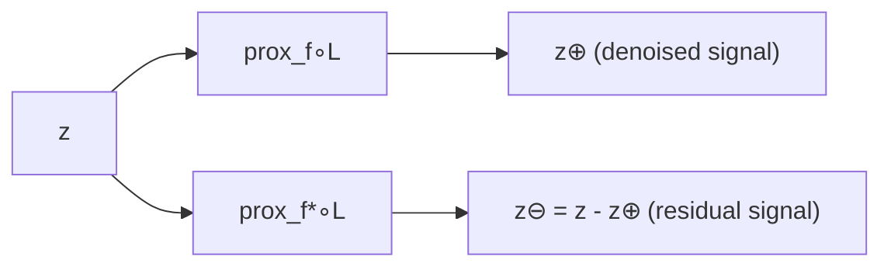

# SIGNAL RECOVERY BY PROXIMAL FORWARD-BACKWARD SPLITTING*

PATRICK L. COMBETTES $^{\dagger}$ AND VALÉRIE R. WAJS $^{\ddagger}$

Abstract. We show that various inverse problems in signal recovery can be formulated as the generic problem of minimizing the sum of two convex functions with certain regularity properties. This formulation makes it possible to derive existence, uniqueness, characterization, and stability results in a unified and standardized fashion for a large class of apparently disparate problems. Recent results on monotone operator splitting methods are applied to establish the convergence of a forward-backward algorithm to solve the generic problem. In turn, we recover, extend, and provide a simplified analysis for a variety of existing iterative methods. Applications to geometry/texture image decomposition schemes are also discussed. A novelty of our framework is to use extensively the notion of a proximity operator, which was introduced by Moreau in the 1960s.

Key words. denoising, forward-backward algorithm, image decomposition, image restoration, multiresolution analysis, inverse problem, signal recovery, iterative soft-thresholding, proximity operator, proximal Landweber method

AMS subject classifications. 94A12, 65K10, 94A08, 90C25

# PII. XXXX

1. Introduction. Signal recovery encompasses the large body of inverse problems in which a multi-dimensional signal $\overline{x}$ is to be inferred from the observation of data z consisting of signals physically or mathematically related to it [23, 66]. The original signal $\overline{x}$ and the observation z are typically assumed to lie in some real Hilbert spaces H and G, respectively. For instance, in image restoration [2], the objective is to recover the original form of an image $\overline{x}$ from the observation of a blurred and noise-corrupted version z, and therefore $H = G$. On the other hand, in signal reconstruction, the data z are indirectly related to $\overline{x}$ and therefore H and G are often different spaces. Thus, in tomography [39], a signal must be recovered from a collection of measurements of lower dimensional signals; in phase retrieval, holography, or band-limited extrapolation [44, 66], a signal must be recovered from partial measurements of its Fourier transform.

Mathematically, signal recovery problems are most conveniently formulated as variational problems, the ultimate goal of which is to incorporate various forms of a priori information and impose some degree of consistency with the measured data z. The objective of the present paper is to investigate in a unified fashion the properties and the numerical solution of a variety of variational formulations which arise in the following format.

PROBLEM 1.1. Let $f_1 \colon \mathcal{H} \to ]-\infty, +\infty]$ and $f_2 \colon \mathcal{H} \to \mathbb{R}$ be two proper lower semi-continuous convex functions such that $f_2$ is differentiable on $\mathcal{H}$ with a $1/\beta$-Lipschitz

continuous gradient for some $\beta \in ]0, +\infty[$. The objective is to

$$
\underset {x \in \mathcal {H}} {\text {minimize}} f _ {1} (x) + f _ {2} (x). \tag {1.1}
$$

The set of solutions to this problem is denoted by $G$.

Despite its simplicity, Problem 1.1 will be shown to cover a wide range of apparently unrelated signal recovery formulations, including constrained least-squares problems [35, 48, 63], multiresolution sparse regularization problems [10, 30, 31, 36], Fourier regularization problems [46, 50], geometry/texture image decomposition problems [5, 6, 7, 57, 71], hard-constrained inconsistent feasibility problems [26], alternating projection signal synthesis problems [38, 60], least square-distance problems [22], split feasibility problems [13, 15], total variation problems [19, 62], as well as certain maximum a posteriori problems [68, 69]. Thus, our study of Problem 1.1 will not only bring together these and other signal recovery approaches within a common simple framework, but it will also capture and extend scattered results pertaining to their properties (existence, uniqueness, characterization, and stability of solutions) and to the convergence of associated numerical methods.

Our investigation relies to a large extent on convex analysis and, in particular, on the notion of a proximity operator, which was introduced by Moreau in $[53]$. Section 2 will provide an account of the main properties of these operators, together with specific examples. In Section 3, we study the properties of Problem 1.1 and analyze the convergence of a general forward-backward splitting algorithm to solve it. The principle of this algorithm is to use at every iteration the functions $f_{1}$ and $f_{2}$ separately; more specifically the core of an iteration consists of a forward (explicit) gradient step on $f_{2}$, followed by a backward (implicit) step on $f_{1}$. In the remaining Sections 4–6, the general results of Section 3 are specialized to various settings and the forward-backward splitting scheme is shown to reduce to familiar signal recovery algorithms, which were obtained and analyzed by different means in the literature. Section 4 is devoted to problems involving sums of Moreau envelopes, Section 5 to problems with linear data formation models, and Section 6 to denoising problems.

1.1. Notation. Let $\mathcal{X}$ be a real Hilbert space. We denote by $\langle \cdot |\cdot \rangle$ its scalar product, by $\| \cdot \|$ the associated norm, and by $d$ the associated distance; Id denotes the identity operator on $\mathcal{X}$ and $B(x;\rho)$ the closed ball of center $x\in \mathcal{X}$ and radius $\rho \in ]0, + \infty[$. The expressions $x_{n}\rightharpoonup x$ and $x_{n}\to x$ denote, respectively, the weak and the strong convergence to $x$ of a sequence $(x_{n})_{n\in \mathbb{N}}$ in $\mathcal{X}$.

Let $\varphi\colon\mathcal{X}\to[-\infty,+\infty]$ be a function. The domain and the epigraph of $\varphi$ are $\mathrm{dom}\,\varphi=\left\{x\in\mathcal{X}\mid\varphi(x)<+\infty\right\}$ and $\mathrm{epi}\,\varphi=\left\{(x,\eta)\in\mathcal{X}\times\mathbb{R}\mid\varphi(x)\leq\eta\right\}$, respectively; $\varphi$ is lower semicontinuous if $\mathrm{epi}\,\varphi$ is closed in $\mathcal{X}\times\mathbb{R}$, and convex if $\mathrm{epi}\,\varphi$ is convex in $\mathcal{X}\times\mathbb{R}$. $\Gamma_{0}(\mathcal{X})$ is the class of all lower semicontinuous convex functions from $\mathcal{X}$ to $]-\infty,+\infty]$ that are not identically $+\infty$.

Let $C$ be a subset of $\mathcal{X}$. The interior of $C$ is denoted by $\operatorname{int} C$ and its closure by $\overline{C}$. If $C$ is nonempty, the distance from a point $x \in \mathcal{X}$ to $C$ is $d_C(x) = \inf \|x - C\|$ ; if $C$ is also closed and convex then, for every $x \in \mathcal{X}$, there exists a unique point $P_C x \in C$ such that $\|x - P_C x\| = d_C(x)$. The point $P_C x$ is the projection of $x$ onto $C$ and it is characterized by the relations

$$
P _ {C} x \in C \quad \text { and } \quad (\forall z \in C) \langle z - P _ {C} x \mid x - P _ {C} x \rangle \leq 0. \tag {1.2}
$$

2. Proximity operators. This section is devoted to the notion of a proximity operator, which was introduced by Moreau in 1962 [53] and further investigated in

[54, 55] as a generalization of the notion of a convex projection operator. Though convex projection operators have been used extensively in nonlinear signal recovery (see [21, 23, 66, 67, 74] and the references therein), the use of proximity operators seems to have been initiated in [24]. Throughout, X and Y are real Hilbert spaces.

2.1. Elements of convex analysis. We recall key facts in convex analysis. Details and further results will be found in [76].

Let $\varphi \in \Gamma_0(\mathcal{X})$. The conjugate of $\varphi$ is the function $\varphi^{*} \in \Gamma_{0}(\mathcal{X})$ defined by

$$
(\forall u \in \mathcal {X}) \varphi^ {*} (u) = \sup _ {x \in \mathcal {X}} \langle x \mid u \rangle - \varphi (x). \tag {2.1}
$$

Moreover, $\varphi^{**} = \varphi$. For instance, the conjugate of the indicator function of a nonempty closed convex set C, i.e.,

$$
\iota_ {C} \colon x \mapsto \left\{ \begin{array}{l l} 0, & \text {if} x \in C; \\ + \infty , & \text {if} x \notin C, \end{array} \right. \tag {2.2}
$$

is the support function of C, i.e.,

$$
\iota_ {C} ^ {*} = \sigma_ {C} \colon u \mapsto \sup _ {x \in C} \langle x \mid u \rangle . \tag {2.3}
$$

Consequently,

$$
\sigma_ {C} ^ {*} = \iota_ {C} ^ {* *} = \iota_ {C}. \tag {2.4}
$$

The subdifferential of $\varphi$ is the set-valued operator $\partial \varphi \colon \mathcal{X} \to 2^{\mathcal{X}}$ the value of which at $x \in \mathcal{X}$ is

$$
\partial \varphi (x) = \left\{u \in \mathcal {X} \mid (\forall y \in \mathcal {X}) \langle y - x \mid u \rangle + \varphi (x) \leq \varphi (y) \right\} \tag {2.5}
$$

or, equivalently,

$$
\partial \varphi (x) = \big \{u \in \mathcal {X} \mid \varphi (x) + \varphi^ {*} (u) = \langle x \mid u \rangle \big \}. \tag {2.6}
$$

Accordingly (Fermat's rule),

$$
(\forall x \in \mathcal {X}) \varphi (x) = \inf \varphi (\mathcal {X}) \Leftrightarrow 0 \in \partial \varphi (x). \tag {2.7}
$$

Moreover, if $\varphi$ is (Gâteaux) differentiable at $x$ with gradient $\nabla \varphi(x)$, then $\partial \varphi(x) = \{\nabla \varphi(x)\}$. Now, let $C$ be a nonempty closed convex subset of $\mathcal{X}$. Then the normal cone operator of $C$ is

$$
N _ {C} = \partial \iota_ {C} \colon x \mapsto \left\{ \begin{array}{l l} \big \{u \in \mathcal {X} \mid (\forall y \in C) \langle y - x \mid u \rangle \leq 0 \big \}, & \text {if} x \in C; \\ \varnothing , & \text {otherwise.} \end{array} \right. \tag {2.8}
$$

Furthermore,

$$
(\forall x \in \mathcal {X}) \partial d _ {C} (x) = \left\{ \begin{array}{l l} \left\{\frac {x - P _ {C} x}{d _ {C} (x)} \right\}, & \text {if} x \notin C; \\ N _ {C} (x) \cap B (0; 1), & \text {if} x \in C. \end{array} \right. \tag {2.9}
$$

LEMMA 2.1. [76, Corollary 2.4.5] Let $(\phi_k)_{1 \leq k \leq m}$ be functions in $\Gamma_0(\mathcal{X})$, let $\mathcal{X}^m$ be the standard Hilbert product space, and let $\varphi: \mathcal{X}^m \to ]-\infty, +\infty]: (x_k)_{1 \leq k \leq m} \mapsto \sum_{k=1}^m \phi_k(x_k)$. Then $\partial \varphi = \times_{k=1}^m \partial \phi_k$.

LEMMA 2.2. Let $\varphi\in\Gamma_{0}(\mathcal{Y})$, let $\psi\in\Gamma_{0}(\mathcal{X})$, and let $L\colon\mathcal{X}\to\mathcal{Y}$ be a bounded linear operator such that $0\in\operatorname{int}\left(\operatorname{dom}\varphi-L(\operatorname{dom}\psi)\right)$. Then

(i) $\partial (\varphi \circ L + \psi) = L^{*}\circ (\partial \varphi)\circ L + \partial \psi$ [76, Theorem 2.8.3].  
(ii) $\inf_{x\in \mathcal{X}}\left(\varphi (Lx) + \psi (x)\right) = -\min_{v\in \mathcal{Y}}\left(\varphi^{*}(v) + \psi^{*}(-L^{*}v)\right)$ (Fenchel-Rockafellar duality formula) [76, Corollary 2.8.5].

# 2.2. Firmly nonexpansive operators.

DEFINITION 2.3. An operator $T \colon \mathcal{X} \to \mathcal{X}$ is firmly nonexpansive if it satisfies one of the following equivalent conditions:

(i) $(\forall (x,y)\in \mathcal{X}^2)$ $\| Tx - Ty\| ^2\leq \langle Tx - Ty\mid x - y\rangle$  
(ii) $(\forall (x,y)\in \mathcal{X}^2)$ $\| Tx - Ty\| ^2\leq \| x - y\|^2 -\| (\mathrm{Id} - T)x - (\mathrm{Id} - T)y\|^2.$

It follows immediately that a firmly nonexpansive operator $T \colon \mathcal{X} \to \mathcal{X}$ is nonexpansive, i.e.,

$$
(\forall (x, y) \in \mathcal {X} ^ {2}) \| T x - T y \| \leq \| x - y \|. \tag {2.10}
$$

2.3. Proximity operators. The Moreau envelope of index $\gamma \in ]0, +\infty[$ of a function $\varphi \in \Gamma_0(\mathcal{X})$ is the continuous convex function

$$
\gamma \varphi \colon \mathcal {X} \to \mathbb {R} \colon x \mapsto \inf _ {y \in \mathcal {X}} \varphi (y) + \frac {1}{2 \gamma} \| x - y \| ^ {2}. \tag {2.11}
$$

For every $x \in \mathcal{X}$, the infimum in (2.11) is achieved at a unique point $\mathrm{prox}_{\gamma \varphi} x$ which is characterized by the inclusion

$$
x - \mathrm{prox} _ {\gamma \varphi}   x \in \gamma \partial \varphi (\mathrm{prox} _ {\gamma \varphi}   x). \tag {2.12}
$$

The operator

$$
\mathrm{prox} _ {\varphi} \colon \mathcal {X} \to \mathcal {X} \colon x \mapsto \underset {y \in \mathcal {X}} {\arg \min} \varphi (y) + \frac {1}{2} \| x - y \| ^ {2} \tag {2.13}
$$

thus defined is called the proximity operator of $\varphi$. Let us note that, if $\varphi = \iota_{C}$, then

$$
\gamma_ {\varphi} = \frac {1}{2 \gamma} d _ {C} ^ {2} \quad \text {and} \quad \mathrm{prox} _ {\gamma \varphi} = P _ {C}. \tag {2.14}
$$

Proximity operators are therefore a generalization of projection operators.

LEMMA 2.4. Let $\varphi \in \Gamma_0(\mathcal{X})$. Then $\mathrm{prox}_{\varphi}$ and $\mathrm{Id} - \mathrm{prox}_{\varphi}$ are firmly nonexpansive.

Proof. The first assertion appears implicitly in [55], we detail the argument for completeness. Take $x$ and $y$ in $\mathcal{X}$. Then (2.12) and (2.5) yield

$$
\left\{ \begin{aligned} \left\langle \operatorname{prox} _ {\varphi} y - \operatorname{prox} _ {\varphi} x \mid x - \operatorname{prox} _ {\varphi} x \right\rangle + \varphi (\operatorname{prox} _ {\varphi} x) &\leq \varphi (\operatorname{prox} _ {\varphi} y) \\ \left\langle \operatorname{prox} _ {\varphi} x - \operatorname{prox} _ {\varphi} y \mid y - \operatorname{prox} _ {\varphi} y \right\rangle + \varphi (\operatorname{prox} _ {\varphi} y) &\leq \varphi (\operatorname{prox} _ {\varphi} x). \end{aligned} \right. \tag {2.15}
$$

Adding these two inequalities, we obtain

$$
\| \operatorname{prox} _ {\varphi} x - \operatorname{prox} _ {\varphi} y \| ^ {2} \leq \big \langle \operatorname{prox} _ {\varphi} x - \operatorname{prox} _ {\varphi} y \mid x - y \big \rangle . \tag {2.16}
$$

The second assertion follows at once from the symmetry between $T$ and $\operatorname{Id} - T$ in Definition 2.3(ii).

LEMMA 2.5. Let $\varphi\in\Gamma_{0}(\mathcal{X})$ and $\gamma\in]0,+\infty[$. Then ${}^{\gamma}\varphi$ is Fréchet-differentiable on $\mathcal{X}$ and $\nabla(\gamma\varphi)=(\mathrm{Id}-\mathrm{prox}_{\gamma\varphi})/\gamma$.

Proof. A routine extension of [55, Proposition 7.d], where $\gamma = 1$.

# 2.4. Proximal calculus.

LEMMA 2.6. Let $\varphi \in \Gamma_0(\mathcal{X})$ and $x\in \mathcal{X}$. Then we have the following.

(i) Quadratic perturbation: Let $\psi = \varphi + \alpha \| \cdot \|^2 / 2 + \langle \cdot | u \rangle + \beta$, where $u \in \mathcal{X}$, $\alpha \in [0, +\infty[$, and $\beta \in \mathbb{R}$. Then $\mathrm{prox}_{\psi} x = \mathrm{prox}_{\varphi / (\alpha + 1)}((x - u) / (\alpha + 1))$.  
(ii) Translation: Let $\psi = \varphi (\cdot -z)$, where $z\in \mathcal{X}$. Then $\mathrm{prox}_{\psi}x = z + \mathrm{prox}_{\varphi}(x - z)$.  
(iii) Scaling: Let $\psi = \varphi (\cdot /\rho)$, where $\rho \in \mathbb{R}\setminus \{0\}$. Then $\mathrm{prox}_{\psi}x = \rho \mathrm{prox}_{\varphi /\rho^2}(x / \rho)$.  
(iv) Reflection: Let $\psi \colon y\mapsto \varphi (-y)$. Then $\mathrm{prox}_{\psi}x = -\mathrm{prox}_{\varphi}(-x)$.  
(v) Moreau envelope: Let $\psi = {}^{\gamma}\varphi$, where $\gamma \in ]0, +\infty[$. Then

$$
\mathrm{prox} _ {\psi} x = x + \frac {1}{\gamma + 1} \big (\mathrm{prox} _ {(\gamma + 1) \varphi} x - x \big). \tag {2.17}
$$

Proof. We observe that in all cases $\psi \in \Gamma_0(\mathcal{X})$. Now set $p = \operatorname{prox}_{\psi} x$. As seen in (2.12), this is equivalent to $x - p \in \partial \psi(p)$.

(i): It follows from Lemma 2.2(i) and (2.12) that $x - p \in \partial \psi(p) \Leftrightarrow x - p \in \partial \varphi(p) + \alpha p + u \Leftrightarrow (x - u) / (\alpha + 1) - p \in \partial (\varphi / (\alpha + 1))(p) \Leftrightarrow p = \mathrm{prox}_{\varphi / (\alpha + 1)}((x - u) / (\alpha + 1)).$  
(ii): It follows from (2.12) that $x - p \in \partial \psi(p) \Leftrightarrow x - p \in \partial \varphi(p - z) \Leftrightarrow (x - z) - (p - z) \in \partial \varphi(p - z) \Leftrightarrow p - z = \mathrm{prox}_{\varphi}(x - z)$.  
(iii): It follows from Lemma 2.2(i) and (2.12) that $x - p \in \partial \psi(p) \Leftrightarrow x - p \in \rho^{-1} \partial \varphi(p / \rho) \Leftrightarrow x / \rho - p / \rho \in \partial (\varphi / \rho^2)(p / \rho) \Leftrightarrow p = \rho \operatorname{prox}_{\varphi / \rho^2}(x / \rho)$.  
(iv): Set $\rho = -1$ in (iii).  
(v): See [27, Lemma 2.2]. □

LEMMA 2.7. Let $\psi = \| \cdot \|^{2} / (2\gamma) - \gamma \varphi$, where $\gamma \in ]0, +\infty[$ and $\varphi \in \Gamma_0(\mathcal{X})$, and let $x \in \mathcal{X}$. Then $\psi \in \Gamma_0(\mathcal{X})$ and

$$
\mathrm{prox} _ {\psi} x = x - \frac {1}{\gamma} \mathrm{prox} _ {\frac {\gamma^ {2}}{\gamma + 1} \varphi} \left(\frac {\gamma x}{\gamma + 1}\right). \tag {2.18}
$$

Proof. Let $\varrho = \gamma \varphi + \| \cdot \|^{2}/2$. Then clearly $\varrho \in \Gamma_{0}(\mathcal{X})$ and hence $\varrho^{*} \in \Gamma_{0}(\mathcal{X})$. However, since (2.1) and (2.11) imply that $\psi = \varrho^{*}/\gamma$, we obtain $\psi \in \Gamma_{0}(\mathcal{X})$. Let us also observe that Lemma 2.5 asserts that $\psi$ is differentiable with gradient $\nabla \psi = \mathrm{prox}_{\gamma \varphi}/\gamma$. Consequently, it follows from (2.12) that

$$
\begin{array}{l} p = \mathrm{prox} _ {\psi} x \Leftrightarrow x - p = \left(\mathrm{prox} _ {\gamma \varphi} p\right) / \gamma \\ \Leftrightarrow p - \gamma (x - p) \in \gamma \partial \varphi (\gamma (x - p)) \\ \Leftrightarrow \frac {\gamma x}{\gamma + 1} - \gamma (x - p) \in \frac {\gamma^ {2}}{\gamma + 1} \partial \varphi \big (\gamma (x - p) \big) \\ \Leftrightarrow \gamma (x - p) = \operatorname{prox} _ {\frac {\gamma^ {2}}{\gamma + 1} \varphi} \left(\frac {\gamma x}{\gamma + 1}\right) \\ \Leftrightarrow p = x - \frac {1}{\gamma} \operatorname{prox} _ {\frac {\gamma^ {2}}{\gamma + 1} \varphi} \left(\frac {\gamma x}{\gamma + 1}\right). \tag {2.19} \\ \end{array}
$$

LEMMA 2.8. Let $\psi = \varphi \circ L$, where $\varphi \in \Gamma_0(\mathcal{Y})$ and where $L: \mathcal{X} \to \mathcal{Y}$ is a bijective bounded linear operator such that $L^{-1} = L^*$. Then $\mathrm{prox}_{\psi} = L^* \circ \mathrm{prox}_{\varphi} \circ L$.

Proof. It follows from the assumptions that $\psi \in \Gamma_0(\mathcal{X})$. Now let $(x,p) \in \mathcal{X}^2$. Since $L$ is surjective, Lemma 2.2(i) asserts that $\partial \psi = L^* \circ (\partial \varphi) \circ L$. Therefore, it follows from (2.12) that $p = \mathrm{prox}_{\psi} x \Leftrightarrow x - p \in L^*(\partial \varphi(Lp)) \Leftrightarrow Lx - Lp \in \partial \varphi(Lp) \Leftrightarrow Lp = \mathrm{prox}_{\varphi}(Lx) \Leftrightarrow p = L^*(\mathrm{prox}_{\varphi}(Lx))$.

LEMMA 2.9. Let $(\phi_k)_{1 \leq k \leq m}$ be functions in $\Gamma_0(\mathcal{X})$, let $\mathcal{X}^m$ be the standard Hilbert product space, and let $\varphi: \mathcal{X}^m \to ]-\infty, +\infty]: (x_k)_{1 \leq k \leq m} \mapsto \sum_{k=1}^m \phi_k(x_k)$. Then $\mathrm{prox}_{\varphi} = (\mathrm{prox}_{\phi_k})_{1 \leq k \leq m}$.

Proof. It is clear that $\varphi\in\Gamma_{0}(\mathcal{X}^{m})$. Now take $(x_{k})_{1\leq k\leq m}$ and $(p_{k})_{1\leq k\leq m}$ in $\mathcal{X}^{m}$. Then it follows from (2.12) and Lemma 2.1 that $(p_{k})_{1\leq k\leq m}= \mathrm{prox}_{\varphi}(x_{k})_{1\leq k\leq m}\Leftrightarrow(x_{k}-p_{k})_{1\leq k\leq m}\in\partial\varphi(p_{k})_{1\leq k\leq m}= \times_{k=1}^{m}\partial\phi_{k}(p_{k})\Leftrightarrow(p_{k})_{1\leq k\leq m}=\left(\mathrm{prox}_{\phi_{k}}x_{k}\right)_{1\leq k\leq m}$.

2.5. Moreau's decomposition. Let $V$ be a closed vector subspace of $\mathcal{X}$ with orthogonal complement $V^{\perp}$. The standard orthogonal projection theorem, which has far reaching applications in signal theory, states that the energy of a signal $x \in \mathcal{X}$ can be decomposed as $\| x\| ^2 = d_V^2 (x) + d_{V^\perp}^2 (x)$ and that $x$ itself can be written as $x = P_Vx + P_{V^\perp}x$, where $\langle P_Vx \mid P_{V^\perp}x\rangle = 0$. If we set $\varphi = \iota_V$, then $\varphi^{*} = \iota_{V^{\perp}}$ and it follows from (2.14) that these identities become $\| x\| ^2 = 2\big(^1\varphi (x) + ^1 (\varphi^{*})(x)\big)$ and $x = \mathrm{prox}_{\varphi}x + \mathrm{prox}_{\varphi^{*}}x$. Moreau has shown that, remarkably, this decomposition principle holds true for any $\varphi \in \Gamma_0(\mathcal{X})$.

LEMMA 2.10. Let $\varphi \in \Gamma_0(\mathcal{X}),\gamma \in ]0, + \infty [,$ and $x\in \mathcal{X}$. Then

$$
\| x \| ^ {2} = 2 \gamma \big (\gamma_ {\varphi} (x) + ^ {1 / \gamma} (\varphi^ {*}) (x / \gamma) \big) \tag {2.20}
$$

and

$$
x &= x _ {\gamma} ^ {\oplus} + x _ {\gamma} ^ {\ominus}, \quad \text {where} \quad \left\{ \begin{aligned} x _ {\gamma} ^ {\oplus} = \operatorname{prox} _ {\gamma \varphi} x \\ x _ {\gamma} ^ {\ominus} &= \gamma \operatorname{prox} _ {\varphi^ {*} / \gamma} (x / \gamma). \end{aligned} \right. \tag {2.21}
$$

Moreover,

$$
\varphi (x _ {\gamma} ^ {\oplus}) + \varphi^ {*} (x _ {\gamma} ^ {\ominus} / \gamma) = \langle x _ {\gamma} ^ {\oplus} \mid x _ {\gamma} ^ {\ominus} \rangle / \gamma . \tag {2.22}
$$

Proof. Using (2.11) and applying Lemma 2.2(ii) with $\mathcal{Y} = \mathcal{X}$, $L = \mathrm{Id}$, and $\psi: y \mapsto \|x - y\|^2 / (2\gamma)$ (hence $\psi^*: v \mapsto \gamma \|v\|^2 / 2 + \langle x \mid v \rangle$ by (2.1)), we obtain

$$
\begin{aligned} \gamma_ {\varphi} (x) &= \inf _ {y \in \mathcal {X}} \varphi (y) + \psi (y) \\ &= - \min _ {v \in \mathcal {X}} \varphi^ {*} (v) + \psi^ {*} (- v) \\ &= - \min _ {v \in \mathcal {X}} \varphi^ {*} (v) + \frac {\gamma}{2} \| v \| ^ {2} - \langle x \mid v \rangle \\ &= \frac {1}{2 \gamma} \| x \| ^ {2} - \min _ {v \in \mathcal {X}} \varphi^ {*} (v) + \frac {\gamma}{2} \| (x / \gamma) - v \| ^ {2} \\ &= \frac {1}{2 \gamma} \| x \| ^ {2} - ^ {1 / \gamma} (\varphi^ {*}) (x / \gamma), \tag {2.23} \\ \end{aligned}
$$

which establishes (2.20). Next, we obtain (2.21) by differentiating (2.20) using Lemma 2.5. Finally, we observe that (2.12) and (2.6) yield

$$
\begin{aligned} x _ {\gamma} ^ {\oplus} &= \mathrm{prox} _ {\gamma \varphi} x \Leftrightarrow x - x _ {\gamma} ^ {\oplus} \in \gamma \partial \varphi (x _ {\gamma} ^ {\oplus}) \\ \Leftrightarrow x _ {\gamma} ^ {\ominus} / \gamma &\in \partial \varphi (x _ {\gamma} ^ {\oplus}) \\ \Leftrightarrow \varphi (x _ {\gamma} ^ {\oplus}) + \varphi^ {*} (x _ {\gamma} ^ {\ominus} / \gamma) &= \langle x _ {\gamma} ^ {\oplus} \mid x _ {\gamma} ^ {\ominus} / \gamma \rangle , \tag {2.24} \\ \end{aligned}
$$

which establishes (2.22). □

REMARK 2.11. Let us make a few remarks concerning Moreau's decomposition.

(i) For $\gamma = 1$, Lemma 2.10 provides the nicely symmetric formulas

$$
\left\{ \begin{aligned} \| x \| ^ {2} &= 2 \big (^ {1} \varphi (x) + ^ {1} (\varphi^ {*}) (x) \big) \\ x &= \operatorname{prox} _ {\varphi} x + \operatorname{prox} _ {\varphi^ {*}} x \\ \varphi \big (\operatorname{prox} _ {\varphi} x \big) + \varphi^ {*} \big (\operatorname{prox} _ {\varphi^ {*}} x \big) &= \big \langle \operatorname{prox} _ {\varphi} x \mid \operatorname{prox} _ {\varphi^ {*}} x \big \rangle , \end{aligned} \right. \tag {2.25}
$$

which correspond to Moreau's original setting; see [53, 55], where alternate proofs are given.

(ii) Let $\varphi = \iota_K$, where $K$ is a closed convex cone in $\mathcal{X}$ (recall that $K \subset \mathcal{X}$ is a convex cone if $K + K \subset K$ and $(\forall \alpha \in ]0, +\infty[)$ $\alpha K \subset K$ ). Then $\varphi^* = \iota_{K^\ominus}$, where $K^\ominus = \{u \in \mathcal{X} \mid (\forall x \in K) \langle x \mid u \rangle \leq 0\}$ is the polar cone of $K$. In this case (2.25) becomes

$$
\left\{ \begin{aligned} \| x \| ^ {2} &= d _ {K} ^ {2} (x) + d _ {K ^ {\ominus}} ^ {2} (x) \\ x &= P _ {K} x + P _ {K ^ {\ominus}} x \\ \langle P _ {K} x \mid P _ {K ^ {\ominus}} x \rangle &= 0. \end{aligned} \right. \tag {2.26}
$$

We thus obtain a decomposition of $x$ into two orthogonal signals $P_Kx$ and $P_{K^{\ominus}}x$. In signal theory, such conical decompositions appear for instance in [14, 66, 74]. They of course subsume the usual linear orthogonal decompositions discussed at the beginning of this section. Moreau established (2.26) prior to (2.25) in [52].

(iii) We have derived (2.21) from the energy decomposition principle (2.20). An alternate derivation can be made using the theory of maximal monotone operators [24].  
(iv) Using Lemma 2.6(iii), we can rewrite (2.21) as

$$
x = x _ {\gamma} ^ {\oplus} + x _ {\gamma} ^ {\ominus}, \text {where} x _ {\gamma} ^ {\oplus} = \mathrm{prox} _ {\gamma \varphi} x \text {and} x _ {\gamma} ^ {\ominus} = \mathrm{prox} _ {\gamma \varphi^ {*} (. / \gamma)} x. \tag {2.27}
$$

(v) Equation (2.21) describes a powerful (generally nonlinear) signal decomposition scheme parameterized by a function $\varphi \in \Gamma_0(\mathcal{X})$ and a scalar $\gamma \in ]0, +\infty[$. Signal denoising applications of this result will be discussed in Section 6.

2.6. Examples of proximity operators. We provide a few examples of proximity operators that are of interest in signal recovery.

EXAMPLE 2.12. Suppose that $\varphi = 0$ in Lemma 2.6(i). Then taking $\alpha = 0$ shows that the translation $x \mapsto x - u$ is a proximity operator, while taking $u = 0$ shows that the transformation $x \mapsto \kappa x$ is also a proximity operator for $\kappa \in ]0,1]$.

More generally, linear proximity operators are characterized as follows.

EXAMPLE 2.13. [55, Section 3] Let $L: \mathcal{X} \to \mathcal{X}$ be a bounded linear operator. Then $L$ is a proximity operator if and only if $L = L^{*}$, $\|L\| \leq 1$, and $(\forall x \in \mathcal{X}) \langle Lx \mid x \rangle \geq 0$.

We have already seen in (2.14) that convex projection operators are proximity operators. More generally, the following example states that underrelaxed convex projection operators are proximity operators.

EXAMPLE 2.14. Let $C$ be a nonempty closed convex subset of $\mathcal{X}$, let $\gamma \in ]0, +\infty[$, and let $x \in \mathcal{X}$. Then $\mathrm{prox}_{d_C^2/(2\gamma)} x = x + \frac{1}{\gamma+1} (P_C x - x)$.

Proof. The proof is a direct consequence of (2.14) and Lemma 2.6(v). □

A hard-thresholding transformation with respect to set distance, i.e.,

$$
x \mapsto \left\{ \begin{array}{l l} x, & \text {if} d _ {C} (x) > \gamma ; \\ P _ {C} x, & \text {if} d _ {C} (x) \leq \gamma , \end{array} \right. \tag {2.28}
$$

is not continuous and can therefore not be performed via a proximity operator (see Lemma 2.4). However, as our next example shows, soft-thresholding transformations can.

EXAMPLE 2.15. Let $C$ be a nonempty closed convex subset of $\mathcal{X}$, let $\gamma \in ]0, +\infty[$, and let $x \in \mathcal{X}$. Then

$$
\mathrm{prox} _ {\gamma d _ {C}} x = \left\{ \begin{array}{l l} x + \frac {\gamma}{d _ {C} (x)} (P _ {C} x - x), & \text {if} d _ {C} (x) > \gamma ; \\ P _ {C} x, & \text {if} d _ {C} (x) \leq \gamma . \end{array} \right. \tag {2.29}
$$

Proof. Suppose that $p = \mathrm{prox}_{\gamma d_C} x$ or, equivalently, that $x - p \in \gamma \partial d_C(p)$. Then, in view of (1.2) and (2.8), it follows from (2.9) that

$$
p &\in C \Rightarrow x - p \in N _ {C} (p) \cap B (0; \gamma) \Rightarrow \left\{ \begin{aligned} p = P _ {C} x \\ d _ {C} (x) &\leq \gamma \end{aligned} \right. \tag {2.30}
$$

and, on the other hand, that

$$
p \notin C \Rightarrow x - p = \gamma \left(\frac {p - P _ {C} p}{d _ {C} (p)}\right)
$$

$$
\begin{aligned} \Rightarrow x - P _ {C} p &= \left(1 + \frac {\gamma}{d _ {C} (p)}\right) (p - P _ {C} p) \in N _ {C} (P _ {C} p) (2.31) \\ \Rightarrow P _ {C} x &= P _ {C} p. (2.32) \\ \end{aligned}
$$

Consequently, we rewrite (2.31) as

$$
p \notin C \Rightarrow x - P _ {C} x = \left(1 + \frac {\gamma}{d _ {C} (p)}\right) (p - P _ {C} p)
$$

$$
\Rightarrow \left\{ \begin{aligned} d _ {C} (x) &= d _ {C} (p) + \gamma \\ p &= x + \frac {\gamma}{d _ {C} (x)} \left(P _ {C} x - x\right). \end{aligned} \right. \tag {2.33}
$$

Now suppose that $d_C(x) > \gamma$. Then $p \notin C$ since otherwise (2.30) would yield $d_C(x) \leq \gamma$, which is absurd. The expression of $p$ is then supplied by (2.33). Next, suppose that $d_C(x) \leq \gamma$. Then $p \in C$ since (2.33) yields $p \notin C \Rightarrow d_C(p) = d_C(x) - \gamma \leq 0 \Rightarrow p \in \overline{C} = C$, which is absurd. The expression of $p$ is then supplied by (2.30).

In the above example, C can be thought of as a set of signals possessing a certain property (see $[21, 23, 29, 67, 74]$ for examples of closed convex sets modeling pertinent constraints in signal recovery). If the signal x is close enough to satisfying the property in question, then $prox_{\gamma d_{C}} x$ is simply the projection of x onto C; otherwise, $prox_{\gamma d_{C}} x$ is obtained through a nonstationary underrelaxation of this projection. Here is an important special case.

EXAMPLE 2.16. Suppose that $C = \{0\}$ in Example 2.15. Then (2.29) becomes

$$
\mathrm{prox} _ {\gamma \| \cdot \|} x = \left\{ \begin{array}{l l} \left(1 - \frac {\gamma}{\| x \|}\right) x, & \text {if} \| x \| > \gamma ; \\ 0, & \text {if} \| x \| \leq \gamma . \end{array} \right. \tag {2.34}
$$

In particular, if $\mathcal{X} = \mathbb{R}$, it reduces to the well-known scalar soft-thresholding (also known as a shrinkage) operation

$$
\mathrm{prox} _ {\gamma | \cdot |}   x = \mathrm{sign} (x) \max \{| x | - \gamma , 0 \}. \tag {2.35}
$$

From a numerical standpoint, Moreau's decomposition (2.21) provides an alternative means to compute $x_{\gamma}^{\oplus} = \mathrm{prox}_{\gamma \varphi}x$. This is especially important in situations when it may be difficult to obtain $x_{\gamma}^{\oplus}$ directly but when the dual problem of applying $\mathrm{prox}_{\varphi^{*} / \gamma}$ is easier. We can then compute $x_{\gamma}^{\oplus} = x - \gamma \mathrm{prox}_{\varphi^{*} / \gamma}(x / \gamma)$ or, using (2.27),

$$
x _ {\gamma} ^ {\oplus} = x - \mathrm{prox} _ {\gamma \varphi^ {*} (\cdot / \gamma)}   x. \tag {2.36}
$$

The following example illustrates this point.

EXAMPLE 2.17. Suppose that $\varphi\colon\mathcal{X}\to]-\infty,+\infty$ is defined as

$$
\varphi \colon x \mapsto \sup _ {y \in D} \langle x \mid L y \rangle , \tag {2.37}
$$

where $L\colon \mathcal{Y}\to \mathcal{X}$ is a bounded linear operator and where $D$ is a nonempty subset of $\mathcal{Y}$. Then $\varphi \in \Gamma_0(\mathcal{X})$. Now let $C$ be the closed convex hull of $L(D)$. Then, using (2.3), we can write (more generally, any positively homogeneous function $\varphi$ in $\Gamma_0(\mathcal{X})$ assumes this form [4, Theorem 2.4.2])

$$
\varphi \colon x \mapsto \sup _ {u \in C} \langle x \mid u \rangle = \sigma_ {C} (x). \tag {2.38}
$$

In turn, (2.4) yields $\varphi^{*} = \sigma_{C}^{*} = \iota_{C}$ and (2.14) asserts that, for every $x \in X$, we can calculate $x_{\gamma}^{\oplus}$ through a projection operation, since (2.36) becomes

$$
x _ {\gamma} ^ {\oplus} = x - \mathrm{prox} _ {\gamma \iota_ {C} (\cdot / \gamma)}   x = x - P _ {\gamma C} x. \tag {2.39}
$$

In the case when $\varphi$ is the discrete total variation functional, this approach is used implicitly in [17].

We now provide an application of the product space setting described in Lemma 2.9.

EXAMPLE 2.18. Let $\gamma \in ]0, +\infty[$ and define a function $\phi \in \Gamma_0(\mathbb{R})$ by

$$
\phi \colon \xi \mapsto \left\{ \begin{array}{l l} - \ln (\xi), & \text {if} \xi > 0; \\ + \infty , & \text {if} \xi \leq 0. \end{array} \right. \tag {2.40}
$$

Then a straightforward calculation gives $(\forall \xi \in \mathbb{R})$ prox $_{\gamma \phi} \xi = (\xi + \sqrt{\xi^2 + 4\gamma}) / 2$. Now let $\varphi$ be the Burg entropy function on the Euclidean space $\mathbb{R}^m$, i.e., $\varphi: x = (\xi_k)_{1 \leq k \leq m} \mapsto \sum_{k=1}^{m} \phi(\xi_k)$. Then it follows from Lemma 2.9 that

$$
\mathrm{prox} _ {\gamma \varphi}   x = \frac {1}{2} \left(\xi_ {k} + \sqrt {\xi_ {k} ^ {2} + 4 \gamma}\right) _ {1 \leq k \leq m}. \tag {2.41}
$$

Our last two examples will play a central role in Section 5.4.

EXAMPLE 2.19. Let $(e_k)_{k\in \mathbb{N}}$ be an orthonormal basis of $\mathcal{X}$, let $(\phi_k)_{k\in \mathbb{N}}$ be functions in $\Gamma_0(\mathbb{R})$ such that

$$
(\forall k \in \mathbb {N}) \phi_ {k} \geq 0 \quad \text { and } \quad \phi_ {k} (0) = 0, \tag {2.42}
$$

and let $\psi\colon\mathcal{X}\to]-\infty,+\infty]:x\mapsto\sum_{k\in\mathbb{N}}\phi_{k}(\langle x\mid e_{k}\rangle)$. Then:

(i) $\psi \in \Gamma_{0}(\mathcal{X})$.  
(ii) $(\forall x\in \mathcal{X})$ $\mathrm{prox}_{\psi}x = \sum_{k\in \mathbb{N}}\big(\mathrm{prox}_{\phi_k}\langle x|e_k\rangle \big)e_k.$

Proof. Let us introduce an operator

$$
L \colon \mathcal {X} \to \ell^ {2} (\mathbb {N}) \colon x \mapsto (\langle x \mid e _ {k} \rangle) _ {k \in \mathbb {N}} \tag {2.43}
$$

and a function

$$
\varphi \colon \ell^ {2} (\mathbb {N}) \to ] - \infty , + \infty ]: (\xi_ {k}) _ {k \in \mathbb {N}} \mapsto \sum_ {k \in \mathbb {N}} \phi_ {k} (\xi_ {k}). \tag {2.44}
$$

From standard Hilbertian analysis, L is an invertible bounded linear operator with

$$
L ^ {- 1} = L ^ {*} \colon \ell^ {2} (\mathbb {N}) \to \mathcal {X} \colon (\xi_ {k}) _ {k \in \mathbb {N}} \mapsto \sum_ {k \in \mathbb {N}} \xi_ {k} e _ {k}. \tag {2.45}
$$

(i): In view of the properties of $L$, since $\psi = \varphi \circ L$, it is enough to show that $\varphi \in \Gamma_0(\ell^2(\mathbb{N}))$. To this end, define, for every $K \in \mathbb{N}$, $\varphi_K = \sum_{k=0}^{K} \varrho_k$, where $\varrho_k: (\xi_l)_{l \in \mathbb{N}} \mapsto \phi_k(\xi_k)$. Then it follows from the assumptions that $\varphi_K$ is lower semicontinuous and convex on $\ell^2(\mathbb{N})$ as a finite sum of such functions. Consequently (see Section 1.1), the sets $(\text{epi } \varphi_K)_{K \in \mathbb{N}}$ are closed and convex in $\ell^2(\mathbb{N}) \times \mathbb{R}$. Therefore, since by assumption (2.42) the functions $(\varphi_K)_{K \in \mathbb{N}}$ are nonnegative, the set

$$
\mathrm{epi}   \varphi = \mathrm{epi} \left(\sup _ {K \in \mathbb {N}} \varphi_ {K}\right) = \bigcap_ {K \in \mathbb {N}} \mathrm{epi}   \varphi_ {K} \tag {2.46}
$$

is also closed and convex as an intersection of closed convex sets. This shows that $\varphi$ is lower semicontinuous and convex. Finally, since (2.42) implies that $\varphi(0) = 0$, we conclude that $\varphi \in \Gamma_0(\ell^2(\mathbb{N}))$.

(ii): Fix $\mathsf{x} = (\xi_{k})_{k \in \mathbb{N}} \in \ell^{2}(\mathbb{N})$. Now set $p = prox_{\varphi} \times$ and $\mathfrak{q} = (\pi_{k})_{k \in \mathbb{N}}$, where $(\forall k \in \mathbb{N}) \pi_{k} = \operatorname{prox}_{\phi_{k}} \xi_{k}$. Then, in view of Lemma 2.8 and (2.45), it suffices to show that p = q. Let us first observe that, for every $k \in N$, (2.42) implies that 0 minimizes $\phi_{k}$ and therefore that $prox_{\phi_{k}} 0 = 0$. Consequently, it follows from the nonexpansivity of the operators $(\operatorname{prox}_{\phi_{k}})_{k \in \mathbb{N}}$ (see Lemma 2.4) that

$$
\sum_ {k \in \mathbb {N}} | \pi_ {k} | ^ {2} = \sum_ {k \in \mathbb {N}} | \operatorname{prox} _ {\phi_ {k}} \xi_ {k} - \operatorname{prox} _ {\phi_ {k}} 0 | ^ {2} \leq \sum_ {k \in \mathbb {N}} | \xi_ {k} - 0 | ^ {2} = \| x \| ^ {2}. \tag {2.47}
$$

Hence $\mathfrak{q} \in \ell^2(\mathbb{N})$. Now let $\mathsf{y} = (\eta_k)_{k \in \mathbb{N}}$ be an arbitrary point in $\ell^2(\mathbb{N})$. It follows from (2.12) and (2.5) that $\mathfrak{p}$ is the unique point in $\ell^2(\mathbb{N})$ that satisfies

$$
\langle \mathbf {y} - \mathbf {p} \mid \mathbf {x} - \mathbf {p} \rangle + \varphi (\mathbf {p}) \leq \varphi (\mathbf {y}). \tag {2.48}
$$

On the other hand, the same characterization for each point in $(\pi_{k})_{k\in\mathbb{N}}$ yields

$$
(\forall k \in \mathbb {N}) (\eta_ {k} - \pi_ {k}) (\xi_ {k} - \pi_ {k}) + \phi_ {k} (\pi_ {k}) \leq \phi_ {k} (\eta_ {k}). \tag {2.49}
$$

Summing these last inequalities over $k \in \mathbb{N}$, we obtain $\langle y - q \mid x - q \rangle + \varphi(q) \leq \varphi(y)$. In view of the characterization (2.48), we conclude that $p = q$.

The following special case is the widely used soft-thresholder that will be discussed in Problem 5.18 and Example 6.3.

EXAMPLE 2.20. Let $(e_k)_{k\in\mathbb{N}}$ be an orthonormal basis of $\mathcal{X}$, let $(\omega_k)_{k\in\mathbb{N}}$ be a sequence in $]0,+\infty[$, let $\psi\colon\mathcal{X}\to]-\infty,+\infty]:x\mapsto\sum_{k\in\mathbb{N}}\omega_k|\langle x|e_k\rangle|$, and let $x\in\mathcal{X}$. Then $\mathrm{prox}_{\psi}x=\sum_{k\in\mathbb{N}}\pi_ke_k$, where

$$
(\forall k \in \mathbb {N}) \pi_ {k} = \mathrm{sign} (\langle x \mid e _ {k} \rangle) \max \{| \langle x \mid e _ {k} \rangle | - \omega_ {k}, 0 \}. \tag {2.50}
$$

Proof. Set $\phi_{k}=\omega_{k}|\cdot|$ in Example 2.19 and use (2.35). □

3. Properties and numerical solution of Problem 1.1. We begin with some basic properties of Problem 1.1. Recall that the set of solutions to this problem is denoted by G.

PROPOSITION 3.1.

(i) Existence: Problem 1.1 possesses at least one solution if $f_{1} + f_{2}$ is coercive, i.e.,

$$
\lim _ {\| x \| \to + \infty} f _ {1} (x) + f _ {2} (x) = + \infty . \tag {3.1}
$$

(ii) Uniqueness: Problem 1.1 possesses at most one solution if $f_{1} + f_{2}$ is strictly convex. This occurs in particular when $f_{1}$ or $f_{2}$ is strictly convex.

(iii) Characterization: Let $x \in \mathcal{H}$ and $\gamma \in ]0, +\infty[$. Then the following statements are equivalent:

(a) $x$ solves Problem 1.1.  
(b) $x = \mathrm{prox}_{\gamma f_1}\left(x - \gamma \nabla f_2(x)\right)$.  
(c) $(\forall y\in \mathcal{H})$ $\langle x - y\mid \nabla f_2(x)\rangle +f_1(x)\leq f_1(y)$

Proof. (i): The assumptions on Problem 1.1 and (3.1) imply that $f_{1} + f_{2}$ lies in $\Gamma_0(\mathcal{H})$ and that it is coercive. Hence the claim follows from [76, Theorem 2.5.1(ii)].

(ii): See [76, Proposition 2.5.6].

(iii): It follows from Fermat's rule (2.7), Lemma 2.2(i), and (2.12) that

$$
x \in G \Leftrightarrow 0 \in \partial (f _ {1} + f _ {2}) (x) = \partial f _ {1} (x) + \partial f _ {2} (x) = \partial f _ {1} (x) + \left\{\nabla f _ {2} (x) \right\} \tag {3.2}
$$

$$
\Leftrightarrow - \nabla f _ {2} (x) \in \partial f _ {1} (x) \tag {3.3}
$$

$$
\Leftrightarrow \left(x - \gamma \nabla f _ {2} (x)\right) - x \in \gamma \partial f _ {1} (x)
$$

$$
\Leftrightarrow x = \mathrm{prox} _ {\gamma f _ {1}} \left(x - \gamma \nabla f _ {2} (x)\right). \tag {3.4}
$$

Using (3.3) and (2.5), we see that $x \in G \Leftrightarrow (\forall y \in \mathcal{H}) \langle y - x | -\nabla f_2(x) \rangle + f_1(x) \leq f_1(y)$.

The fixed point characterization provided by Proposition 3.1(iii)(b) suggests solving Problem 1.1 via the fixed point iteration $x_{n+1} = \mathrm{prox}_{\gamma f_1}(x_n - \gamma \nabla f_2(x_n))$ for a suitable value of the parameter $\gamma$. This iteration, which is referred to as a forward-backward splitting process in optimization, consists of two separate steps. First one performs a forward (explicit) step involving only $f_2$ to compute $x_{n+\frac{1}{2}} = x_n - \gamma \nabla f_2(x_n)$ ; then one performs a backward (implicit) step involving only $f_1$ to compute $x_{n+1} = \mathrm{prox}_{\gamma f_1} x_{n+\frac{1}{2}}$. Formally, this second step amounts to solving the inclusion (2.12), hence its implicit nature. The following theorem is an adaption of some results from [25], which provides a more general iteration in which the coefficient $\gamma$ is made iteration-dependent, errors are allowed in the evaluation of the operators $\mathrm{prox}_{\gamma f_1}$ and $\nabla f_2$, and a relaxation sequence $(\lambda_n)_{n \in \mathbb{N}}$ is introduced. The errors allow for some tolerance in the numerical implementation of the algorithm, while the flexibility introduced by the iteration-dependent parameters $\gamma_n$ and $\lambda_n$ can be used to improve its convergence pattern.

First, we need to introduce the following condition.

CONDITION 3.2. Let X be a nonempty subset of a real Hilbert space X. We say that a function $\varphi \in \Gamma_{0}(\mathcal{X})$ satisfies this condition on X if for all sequences $(y_{n})_{n \in \mathbb{N}}$ and $(v_{n})_{n \in \mathbb{N}}$ in X and points $y \in X$ and $v \in \partial\varphi(y)$, we have

(3.5)

$\left[ y_n \rightharpoonup y, v_n \to v, (\forall n \in \mathbb{N}) v_n \in \partial \varphi(y_n) \right] \Rightarrow y$ is a strong cluster point of $(y_n)_{n \in \mathbb{N}}$.

REMARK 3.3. In Condition 3.2, the inclusion $v \in \partial \varphi(y)$ is redundant and stated only for the sake of clarity. Indeed, since $\varphi \in \Gamma_0(\mathcal{X})$, $\partial \varphi$ is maximal monotone [76, Theorem 3.1.11] and its graph is therefore sequentially weakly-strongly closed in $\mathcal{X} \times \mathcal{X}$ [4, Proposition 3.5.6.2]. Accordingly, the statements $y_n \rightharpoonup y$, $v_n \to v$, and $(\forall n \in \mathbb{N})$ $v_n \in \partial \varphi(y_n)$ imply that $v \in \partial \varphi(y)$.

Here is our main convergence result (recall that $f_{1}$, $f_{2}$, $\beta$, and G are defined in Problem 1.1).

THEOREM 3.4. Suppose that $G \neq \varnothing$. Let $(\gamma_n)_{n \in \mathbb{N}}$ be a sequence in $]0, +\infty[$ such that $0 < \inf_{n \in \mathbb{N}} \gamma_n \leq \sup_{n \in \mathbb{N}} \gamma_n < 2\beta$, let $(\lambda_n)_{n \in \mathbb{N}}$ be a sequence in $]0,1]$ such that $\inf_{n \in \mathbb{N}} \lambda_n > 0$, and let $(a_n)_{n \in \mathbb{N}}$ and $(b_n)_{n \in \mathbb{N}}$ be sequences in $\mathcal{H}$ such that $\sum_{n \in \mathbb{N}} \|a_n\| < +\infty$ and $\sum_{n \in \mathbb{N}} \|b_n\| < +\infty$. Fix $x_0 \in \mathcal{H}$ and, for every $n \in \mathbb{N}$, set

$$
x _ {n + 1} = x _ {n} + \lambda_ {n} \bigg (\mathrm{prox} _ {\gamma_ {n} f _ {1}} \left(x _ {n} - \gamma_ {n} (\nabla f _ {2} (x _ {n}) + b _ {n})\right) + a _ {n} - x _ {n} \bigg). \tag {3.6}
$$

Then the following hold.

(i) $(x_{n})_{n\in \mathbb{N}}$ converges weakly to a point $x\in G$  
(ii) $\sum_{n\in \mathbb{N}}\| \nabla f_2(x_n) - \nabla f_2(x)\| ^2 < + \infty .$  
(iii) $\sum_{n\in \mathbb{N}}\left\| \mathrm{prox}_{\gamma_n f_1}\left(x_n - \gamma_n\nabla f_2(x_n)\right) - x_n\right\|^2 < + \infty .$  
(iv) $(x_{n})_{n\in \mathbb{N}}$ converges strongly to $x$ if and only if $\varliminf d_G(x_n) = 0$. In particular, strong convergence occurs in each of the following cases:  
(a) int G ≠ ∅.  
(b) $f_{1}$ satisfies Condition 3.2 on $G$.  
(c) $f_{2}$ satisfies Condition 3.2 on $G$.

Proof. It follows from (3.2) that

$$
G = \big \{x \in \mathcal {H} \mid 0 \in \partial f _ {1} (x) + \{\nabla f _ {2} (x) \} \big \}. \tag {3.7}
$$

Now let $A = \partial f_{1}$ and $B = \nabla f_{2}$. Since $f_{1} \in \Gamma_{0}(\mathcal{H})$, [76, Theorem 3.1.11] asserts that $A$ is maximal monotone. On the other hand since, by assumption, $\nabla f_{2}$ is $1 / \beta$ -Lipschitz continuous, it follows from [8, Corollaire 10] that $\beta B$ is firmly nonexpansive.

(i): Applying [25, Corollary 6.5], we obtain that $(x_{n})_{n\in \mathbb{N}}$ converges weakly to a point $x\in (A + B)^{-1}(0) = G$.

(ii)&(iii): As in [25, Eq. (6.4)] set, for every $n \in \mathbb{N}$, $T_{1,n} = \mathrm{prox}_{\gamma_n f_1}$, $\alpha_{1,n} = 1/2$, $T_{2,n} = \mathrm{Id} - \gamma_n \nabla f_2$, and $\alpha_{2,n} = \gamma_n / (2\beta)$. Then [25, Remark 3.4] with $m = 2$ yields

$$
\left\{ \begin{aligned} \sum_ {n &\in \mathbb {N}} \| (\operatorname{Id} - T _ {2, n}) x _ {n} - (\operatorname{Id} - T _ {2, n}) x \| ^ {2} <   + \infty \\ \sum_ {n &\in \mathbb {N}} \| (T _ {1, n} \circ T _ {2, n}) x _ {n} - x _ {n} \| ^ {2} <   + \infty . \end{aligned} \right. \tag {3.8}
$$

The assumptions on $(\gamma_{n})_{n\in\mathbb{N}}$ then provide the desired summability results.

(iv): The characterization of strong convergence follows from [25, Theorem 3.3].

(iv)(a): This is shown in [25, Remark 6.6].

(iv)(b): Set $v = -\nabla f_{2}(x)$ and

$$
\left(\forall n &\in \mathbb {N}\right) \quad \left\{ \begin{aligned} y _ {n} = \operatorname{prox} _ {\gamma_ {n} f _ {1}} \left(x _ {n} - \gamma_ {n} \nabla f _ {2} (x _ {n})\right) \\ v _ {n} &= (x _ {n} - y _ {n}) / \gamma_ {n} - \nabla f _ {2} (x _ {n}). \end{aligned} \right. \tag {3.9}
$$

Then (2.12) yields $(\forall n\in \mathbb{N})$ $v_{n}\in \partial f_{1}(y_{n})$. On the other hand, we derive from (i) and (iii) that $y_{n}\rightharpoonup x\in G$. Furthermore, since

$$
(\forall n \in \mathbb {N}) \| v _ {n} - v \| \leq \frac {\| x _ {n} - y _ {n} \|}{\gamma_ {n}} + \| \nabla f _ {2} (x _ {n}) - \nabla f _ {2} (x) \|, \tag {3.10}
$$

it follows from (ii), (iii), and the condition $\inf_{n\in \mathbb{N}}\gamma_n > 0$ that $v_{n}\to v$. It then results from Condition 3.2 that we can extract a subsequence $(y_{k_n})_{n\in \mathbb{N}}$ such that $y_{k_n}\rightarrow x$ and, in turn, from (iii) that $x_{k_n}\to x$. Accordingly, since $x\in G$, we have $d_G(x_{k_n})\to 0$ and therefore $\varliminf d_G(x_n) = 0$.

(iv)(c): Set $v = \nabla f_2(x)$ and $(\forall n \in \mathbb{N})$ $v_n = \nabla f_2(x_n)$ (so certainly $v_n \in \partial f_2(x_n) = \{\nabla f_2(x_n)\}$ ). Then (i) yields $x_n \rightharpoonup x$ while (ii) yields $v_n \to v$. Therefore Condition 3.2 implies that $x \in G$ is a strong cluster point of $(x_n)_{n \in \mathbb{N}}$ and we conclude that $\varliminf d_G(x_n) = 0$.

REMARK 3.5. If $f_{2} = 0$, $\lambda_{n} \equiv 1$, and $b_{n} \equiv 0$ in Theorem 3.4, we recover the proximal point algorithm and item (i), which states that $(x_{n})_{n \in \mathbb{N}}$ converges weakly to a minimizer of $f_{1}$, follows from [61, Theorem 1].

Further special cases of Theorem 3.4(iv)(b)&(iv)(c) can be constructed from the following proposition.

PROPOSITION 3.6. Let X be a real Hilbert space. Suppose that $\varphi \in \Gamma_{0}(\mathcal{X})$ and that $\varnothing \neq X \subset D$, where $D = \operatorname{dom} \varphi$. Let C be the set of all nondecreasing functions from $[0, +\infty[$ to $[0, +\infty]$ that vanish only at 0. Then $\varphi$ satisfies Condition 3.2 on X in each of the following cases:

(i) $D$ is boundedly relatively compact (the closure of its intersection with any closed ball is compact).

(ii) $\varphi$ is differentiable on $\mathcal{X}$ and $\operatorname{Id} - \nabla \varphi$ is demicompact [77, Section 10.4]: for every bounded sequence $(y_{n})_{n\in \mathbb{N}}$ in $\mathcal{X}$ such that $\left(\nabla \varphi (y_n)\right)_{n\in \mathbb{N}}$ converges strongly, $(y_{n})_{n\in \mathbb{N}}$ admits a strong cluster point.

(iii) For every $y \in X$ and $v \in \partial \varphi(y)$ there exists a function $c \in \mathcal{C}$ such that

$$
(\forall x \in D) \langle x - y \mid v \rangle + \varphi (y) + c (\| x - y \|) \leq \varphi (x). \tag {3.11}
$$

(iv) $\varphi$ is uniformly convex at every point in $X$ : for every $y \in X$ there exists a function $c \in \mathcal{C}$ such that, for every $x \in D$,

(3.12)

$$
(\forall \alpha \in ] 0, 1 [) \varphi (\alpha x + (1 - \alpha) y) + \alpha (1 - \alpha) c (\| x - y \|) \leq \alpha \varphi (x) + (1 - \alpha) \varphi (y).
$$

(v) $\varphi$ is uniformly convex: there exists a function $c \in \mathcal{C}$ such that, for every $x$ and $y$ in $D$, (3.12) holds.

(vi) $\varphi$ is uniformly convex on bounded sets: for every bounded convex set $C \subset \mathcal{X}$, $\varphi + \iota_C$ is uniformly convex, i.e., there exists a function $c \in \mathcal{C}$ such that, for every $x$ and $y$ in $C \cap D$, (3.12) holds.

(vii) $\varphi$ is strongly convex.

Proof. Take sequences $(y_{n})_{n\in \mathbb{N}}$ and $(v_{n})_{n\in \mathbb{N}}$ in $\mathcal{X}$ and points $y\in X$ and $v\in \partial \varphi (y)$ such that $y_{n}\rightharpoonup y,v_{n}\to v,$ and $(\forall n\in \mathbb{N})v_{n}\in \partial \varphi (y_{n})$.

(i): The sequence $(y_{n})_{n\in \mathbb{N}}$ is bounded (since it converges weakly) and lies in $\operatorname{dom}\partial \varphi \subset D$. It therefore lies in a compact set and, as a result, $y$ must be a strong cluster point.

(ii): The sequence $(y_{n})_{n\in \mathbb{N}}$ is bounded and, since $\varphi$ is differentiable, $(\forall n\in \mathbb{N})$ $\nabla \varphi (y_n) = v_n\to v$. Hence the demicompactness assumption implies that we can extract a subsequence $(y_{k_n})_{n\in \mathbb{N}}$ that converges strongly. Since $y_{n}\rightharpoonup y$, we conclude that $y_{k_n}\rightarrow y$.

(iii): It follows from (3.11) that

$$
(\forall n \in \mathbb {N}) \langle y _ {n} - y \mid v \rangle + \varphi (y) + c (\| y _ {n} - y \|) \leq \varphi (y _ {n}). \tag {3.13}
$$

On the other hand, it follows from (2.5) that

$$
(\forall n \in \mathbb {N}) \langle y - y _ {n} \mid v _ {n} \rangle + \varphi (y _ {n}) \leq \varphi (y). \tag {3.14}
$$

Adding these two inequalities, we obtain

$$
(\forall n \in \mathbb {N}) c (\| y _ {n} - y \|) \leq \langle y _ {n} - y \mid v _ {n} - v \rangle . \tag {3.15}
$$

However, since $y_{n} \rightharpoonup y$ and $v_{n} \rightarrow v$, we have $\langle y_{n} - y \mid v_{n} - v \rangle \rightarrow 0$. Therefore the assumptions on c and (3.15) yield $\|y_{n} - y\| \rightarrow 0$.

(iv): For every $x$ in $D$, we have [76, Section 3.5]

$$
\Rightarrow \quad \langle x - y \mid v \rangle + \varphi (y) + c (\| x - y \|) \leq \varphi (x). \tag {3.16}
$$

Hence (iv) is a special case of (iii).

(v): This is a special case of (iv).  
(vi): Since $y_{n} \rightharpoonup y$, $(y_{n})_{n \in \mathbb{N}}$ and $y$ lie in some closed ball $C$. However since $f + \iota_{C}$ is uniformly convex, there exists $c \in \mathcal{C}$ such that (3.12) holds true for every $x \in C \cap D$. Thus, we deduce from (3.16) that (3.13) is satisfied, and we conclude as in (iii).  
(vii): This is a special case of (v) with $c: t \mapsto \rho t^2 / 2$ for some $\rho \in ]0, +\infty[$ [76, Section 3.5].

Examples of functions satisfying the various types of uniform convexity defined above can be found in [12, 75].

# 4. Problems involving sums of Moreau envelopes.

4.1. Problem statement. We consider the following formulation, which is based on the notion of a Moreau envelope defined in (2.11).

PROBLEM 4.1. Let

(i) $(\mathcal{K}_i)_{1\leq i\leq m}$ be real Hilbert spaces;  
(ii) for every $i \in \{1, \dots, m\}$, $L_i \colon \mathcal{H} \to \mathcal{K}_i$ be a nonzero bounded linear operator, $\varphi_i \in \Gamma_0(\mathcal{K}_i)$, and $\rho_i \in ]0, +\infty[$ ;  
(iii) $f_{1} \in \Gamma_{0}(\mathcal{H})$.

The objective is to

$$
\underset {x \in \mathcal {H}} {\text {minimize}} f _ {1} (x) + \sum_ {i = 1} ^ {m} \rho_ {i} \varphi_ {i} (L _ {i} x). \tag {4.1}
$$

The set of solutions to this problem is denoted by G.

PROPOSITION 4.2. Problem 4.1 is a special case of Problem 1.1 with $f_{2} = \sum_{i=1}^{m} \left( \rho_{i} \varphi_{i} \right) \circ L_{i}$ and $\beta = \left( \sum_{i=1}^{m} \|L_{i}\|^{2}/\rho_{i} \right)^{-1}$.

Proof. Set

$$
f _ {2} = \sum_ {i = 1} ^ {m} \left(\rho_ {i} \varphi_ {i}\right) \circ L _ {i} \quad \text {and} \quad \beta = \left(\sum_ {i = 1} ^ {m} \| L _ {i} \| ^ {2} / \rho_ {i}\right) ^ {- 1}. \tag {4.2}
$$

Since, for every $i \in \{1, \dots, m\}$, the function $\rho_i \varphi_i$ is finite, continuous, and convex, it belongs to $\Gamma_0(\mathcal{K}_i)$ and therefore $(\rho_i \varphi_i) \circ L_i \in \Gamma_0(\mathcal{H})$. Consequently, $f_2$ belongs to $\Gamma_0(\mathcal{H})$. Now, set $(\forall i \in \{1, \dots, m\})$ $T_i = \mathrm{Id} - \mathrm{prox}_{\rho_i \varphi_i}$. As seen in Lemma 2.4, the operators $(T_i)_{1 \leq i \leq m}$ are (firmly) nonexpansive. Therefore, for every $i \in \{1, \dots, m\}$, we obtain

$$
\begin{aligned} (\forall (x, y) &\in \mathcal {H} ^ {2}) \| \left(L _ {i} ^ {*} \circ T _ {i} \circ L _ {i}\right) x - \left(L _ {i} ^ {*} \circ T _ {i} \circ L _ {i}\right) y \| \leq \| L _ {i} ^ {*} \| \cdot \| T _ {i} \left(L _ {i} x\right) - T _ {i} \left(L _ {i} y\right) \| \\ &\leq \| L _ {i} ^ {*} \| \cdot \| L _ {i} x - L _ {i} y \| \\ &\leq \left\| L _ {i} ^ {*} \right\| \cdot \left\| L _ {i} \right\| \cdot \| x - y \| \\ &= \| L _ {i} \| ^ {2} \cdot \| x - y \|. \tag {4.3} \\ \end{aligned}
$$

On the other hand, we derive from Lemma 2.5 that

$$
\nabla f _ {2} = \sum_ {i = 1} ^ {m} \nabla \bigl ((\rho_ {i} \varphi_ {i}) \circ L _ {i} \bigr) = \sum_ {i = 1} ^ {m} L _ {i} ^ {*} \circ \left(\frac {T _ {i}}{\rho_ {i}}\right) \circ L _ {i} = \sum_ {i = 1} ^ {m} \frac {1}{\rho_ {i}} L _ {i} ^ {*} \circ T _ {i} \circ L _ {i}. \tag {4.4}
$$

Since (4.3) states that each operator $L_i^* \circ T_i \circ L_i$ is Lipschitz continuous with constant $\| L_i\|^2$, it ensues that $\nabla f_2$ is Lipschitz continuous with constant $\sum_{i=1}^{m} \| L_i\|^2 / \rho_i$. We conclude that $\nabla f_2$ is $1/\beta$ -Lipschitz continuous.

4.2. Properties and numerical solution of Problem 4.1. The following is a specialization of Theorem 3.4, in which we omit items (ii) and (iii) for the sake of brevity (special cases of item (ii) below can be derived from Theorem 3.4 and Proposition 3.6). The algorithm allows for the inexact computation of each proximity operator.

THEOREM 4.3. Suppose that $G \neq \varnothing$. Let $(\gamma_n)_{n \in \mathbb{N}}$ be a sequence in $]0, +\infty[$ such that $0 < \inf_{n \in \mathbb{N}} \gamma_n \leq \sup_{n \in \mathbb{N}} \gamma_n < 2 \left( \sum_{i=1}^{m} \|L_i\|^2/\rho_i \right)^{-1}$, let $(\lambda_n)_{n \in \mathbb{N}}$ be a sequence in $]0, 1]$ such that $\inf_{n \in \mathbb{N}} \lambda_n > 0$, and let $(a_n)_{n \in \mathbb{N}}$ and $((b_{i,n})_{n \in \mathbb{N}})_{1 \leq i \leq m}$ be sequences in $\mathcal{H}$ such that $\sum_{n \in \mathbb{N}} \|a_n\| < +\infty$ and $\max_{1 \leq i \leq m} \sum_{n \in \mathbb{N}} \|b_{i,n}\| < +\infty$. Fix $x_0 \in \mathcal{H}$ and, for every $n \in \mathbb{N}$, set

(4.5) $x_{n + 1} = x_n+$

$$
\lambda_ {n} \bigg (\operatorname{prox} _ {\gamma_ {n} f _ {1}} \left(x _ {n} + \gamma_ {n} \bigg (\sum_ {i = 1} ^ {m} \frac {1}{\rho_ {i}} \big ((L _ {i} ^ {*} \circ (\operatorname{prox} _ {\rho_ {i} \varphi_ {i}} - \operatorname{Id}) \circ L _ {i}) x _ {n} + b _ {i, n} \big)\right) \bigg) + a _ {n} - x _ {n} \bigg).
$$

Then:

(i) $(x_{n})_{n\in \mathbb{N}}$ converges weakly to a point $x\in G$.  
(ii) $(x_{n})_{n\in \mathbb{N}}$ converges strongly to $x$ if and only if $\underline{\lim} d_G(x_n) = 0$.

Proof. The proof is a consequence of Proposition 4.2 and Theorem 3.4(i)&(iv) with $b_{n} = -\sum_{i=1}^{m} b_{i,n} / \rho_{i}$ and $\nabla f_{2}$ given by (4.4). □

4.3. Proximal split feasibility problems. We shall call the special case of Problem 4.1 when $m = 1$ a proximal split feasibility problem. In other words, we are given a real Hilbert space $\mathcal{K}$, a nonzero bounded linear operator $L\colon \mathcal{H} \to \mathcal{K}$, a function $f_1 \in \Gamma_0(\mathcal{H})$, a function $\varphi \in \Gamma_0(\mathcal{K})$, and a real number $\rho \in ]0, +\infty[$. The objective is to

$$
\underset {x \in \mathcal {H}} {\text {minimize}} f _ {1} (x) + ^ {\rho} \varphi (L x). \tag {4.6}
$$

We denote by G the set of solutions to this problem.

Applying Theorem 4.3 with $m = 1$, we obtain at once the following convergence result.

COROLLARY 4.4. Suppose that $G \neq \varnothing$. Let $(\gamma_n)_{n \in \mathbb{N}}$ be a sequence in $]0, +\infty[$ such that $0 < \inf_{n \in \mathbb{N}} \gamma_n \leq \sup_{n \in \mathbb{N}} \gamma_n < 2\rho / \|L\|^2$, let $(\lambda_n)_{n \in \mathbb{N}}$ be a sequence in $]0,1]$ such that $\inf_{n \in \mathbb{N}} \lambda_n > 0$, and let $(a_n)_{n \in \mathbb{N}}$ and $(b_n)_{n \in \mathbb{N}}$ be sequences in $\mathcal{H}$ such that $\sum_{n \in \mathbb{N}} \|a_n\| < +\infty$ and $\sum_{n \in \mathbb{N}} \|b_n\| < +\infty$. Fix $x_0 \in \mathcal{H}$ and, for every $n \in \mathbb{N}$, set

$$
x _ {n + 1} = x _ {n} + \lambda_ {n} \Bigg (\operatorname{prox} _ {\gamma_ {n} f _ {1}} \left(x _ {n} + \frac {\gamma_ {n}}{\rho} \big ((L ^ {*} \circ (\operatorname{prox} _ {\rho \varphi} - \operatorname{Id}) \circ L) x _ {n} + b _ {n} \big)\right) + a _ {n} - x _ {n} \Bigg). \tag {4.7}
$$

Then:

(i) $(x_{n})_{n\in \mathbb{N}}$ converges weakly to a point $x\in G$.  
(ii) $(x_{n})_{n\in \mathbb{N}}$ converges strongly to $x$ if and only if $\underline{\lim} d_G(x_n) = 0$.

Now, let us specialize the above setting to the case when $\rho = 1$, $f_{1} = \iota_{C}$ and $\varphi = \iota_{Q}$, where $C \subset H$ and $Q \subset K$ are two nonempty closed convex sets. Then, in view of (2.14), (4.6) becomes

$$
\underset {x \in C} {\text {minimize}} d _ {Q} (L x). \tag {4.8}
$$

In other words, one seeks a signal $x \in C$ such that the signal Lx is at minimal distance from Q; in particular, when $C \cap L^{-1}(Q) \neq \varnothing$, one seeks a signal in $x \in C$ such that $Lx \in Q$. This is the so-called split feasibility problem introduced in [15] and further discussed in [13]. Let us observe that one of the earliest occurrence of this formulation is actually that provided by Youla in [73]. In that paper, the problem was to find a signal x in a closed vector subspace C, knowing its projection p onto a closed vector subspace V (hence $L = P_V$ and $Q = \{p\}$ ); it was also observed that the standard signal extrapolation schemes of Gerchberg [37] and Papoulis [59] fitted this framework.

In the present setting, Corollary 4.4(i) reduces to the following corollary.

COROLLARY 4.5. Suppose that the set $G$ of solutions to (4.8) is nonempty. Let $(\gamma_n)_{n\in \mathbb{N}}$ be a sequence in $]0, +\infty[$ such that $0 < \inf_{n\in \mathbb{N}}\gamma_n\leq \sup_{n\in \mathbb{N}}\gamma_n < 2 / \| L\|^2$, let $(\lambda_n)_{n\in \mathbb{N}}$ be a sequence in $]0,1]$ such that $\inf_{n\in \mathbb{N}}\lambda_n > 0$, and let $(a_n)_{n\in \mathbb{N}}$ and $(b_n)_{n\in \mathbb{N}}$ be sequences in $\mathcal{H}$ such that $\sum_{n\in \mathbb{N}}\| a_n\| < +\infty$ and $\sum_{n\in \mathbb{N}}\| b_n\| < +\infty$. Fix $x_0\in \mathcal{H}$ and, for every $n\in \mathbb{N}$, set

$$
x _ {n + 1} = x _ {n} + \lambda_ {n} \bigg (P _ {C} \bigg (x _ {n} + \gamma_ {n} \big ((L ^ {*} \circ (P _ {Q} - \mathrm{Id}) \circ L) x _ {n} + b _ {n} \big) \bigg) + a _ {n} - x _ {n} \bigg). \tag {4.9}
$$

Then $(x_{n})_{n\in \mathbb{N}}$ converges weakly to a point $x\in G$.

REMARK 4.6. Corollary 4.5 improves upon [13, Theorem 2.1], where the additional assumptions $\dim \mathcal{H} < +\infty$, $\dim \mathcal{K} < +\infty$, $\lambda_n \equiv 1$, $\gamma_n \equiv \gamma \in ]0, 2/\|L\|^2[$, $a_n \equiv 0$, and $b_n \equiv 0$ were made.

4.4. The $u+v$ signal decomposition model. Underlying many signal recovery problems is the decomposition of a signal $x \in H$ as $x = u + v$, where u captures the geometric components of the signal (typically a function with bounded variations) and v models texture (typically an oscillatory function), e.g., [5, 6, 7, 51, 57, 71, 72]. The variational formulations proposed in [5, 6, 7, 71, 72] to achieve this decomposition based on a noisy observation $z \in H$ of the signal of interest are of the general form

$$
\underset {(u, v) \in \mathcal {H} \times \mathcal {H}} {\text {minimize}} \psi (u) + \phi (v) + \frac {1}{2 \rho} \| u + v - z \| ^ {2}, \tag {4.10}
$$

where $\psi$ and $\phi$ are in $\Gamma_0(\mathcal{H})$ and $\rho \in ]0, +\infty[$. In order to cast this problem in our framework, let us introduce the function

$$
\varphi \colon \mathcal {H} \to ] - \infty , + \infty ]: w \mapsto \phi (z - w). \tag {4.11}
$$

Then $\varphi \in \Gamma_0(\mathcal{H})$ and the change of variable

$$
w = z - v \tag {4.12}
$$

in (4.10) yields

$$
\underset {(u, w) \in \mathcal {H} \times \mathcal {H}} {\text {minimize}} \psi (u) + \varphi (w) + \frac {1}{2 \rho} \| u - w \| ^ {2}. \tag {4.13}
$$

In view of (2.11), this problem can be rewritten in terms of the variable u as

$$
\underset {u \in \mathcal {H}} {\text {minimize}} \psi (u) + ^ {\rho} \varphi (u). \tag {4.14}
$$

In other words, we obtain precisely the formulation (4.6) with $f_{1} = \psi$, $\mathcal{K} = \mathcal{H}$, and $L = \mathrm{Id}$.

We now derive from Corollary 4.4 and some facts from [9] the following result.

COROLLARY 4.7. Suppose that (4.10) has at least one solution. Let $(\gamma_n)_{n \in \mathbb{N}}$ be a sequence in $]0, +\infty[$ such that $0 < \inf_{n \in \mathbb{N}} \gamma_n \leq \sup_{n \in \mathbb{N}} \gamma_n < 2\rho$, let $(\lambda_n)_{n \in \mathbb{N}}$ be a sequence in $]0, 1]$ such that $\inf_{n \in \mathbb{N}} \lambda_n > 0$, and let $(a_n)_{n \in \mathbb{N}}$ and $(b_n)_{n \in \mathbb{N}}$ be sequences in $\mathcal{H}$ such that $\sum_{n \in \mathbb{N}} \|a_n\| < +\infty$ and $\sum_{n \in \mathbb{N}} \|b_n\| < +\infty$. Fix $u_0 \in \mathcal{H}$ and, for every $n \in \mathbb{N}$, set

$$
u _ {n + 1} = u _ {n} + \lambda_ {n} \bigg (\operatorname{prox} _ {\gamma_ {n} \psi} \left(u _ {n} + \frac {\gamma_ {n}}{\rho} \big (z - \operatorname{prox} _ {\rho \phi} (z - u _ {n}) - u _ {n} + b _ {n} \big)\right) + a _ {n} - u _ {n} \bigg). \tag {4.15}
$$

Then $(u_{n})_{n\in \mathbb{N}}$ converges weakly to a solution $u$ to (4.14) and $\left(u,\mathrm{prox}_{\rho \phi}(z - u)\right)$ is a solution to (4.10).

Proof. By assumption, the set G of solutions to (4.14) is nonempty. As noted above, (4.14) is a special case of (4.6) with $f_{1} = \psi$, K = H, and L = Id. Moreover, in this case, (4.7) reduces to

$$
u _ {n + 1} = u _ {n} + \lambda_ {n} \bigg (\operatorname{prox} _ {\gamma_ {n} \psi} \left(u _ {n} + \frac {\gamma_ {n}}{\rho} (\operatorname{prox} _ {\rho \varphi} u _ {n} - u _ {n} + b _ {n})\right) + a _ {n} - u _ {n} \bigg). \tag {4.16}
$$

However, using (4.11) and Lemma 2.6(ii)&(iv), we obtain

$$
(\forall x \in \mathcal {H}) \operatorname{prox} _ {\rho \varphi} x = z - \operatorname{prox} _ {\rho \phi} (z - x). \tag {4.17}
$$

Therefore, (4.16) coincides with (4.15). Hence, since $\|L\|=1$, we derive from Corollary 4.4 that the sequence $(u_{n})_{n\in\mathbb{N}}$ converges weakly to a point $u\in G$. It then follows from [9, Propositions 3.2 and 4.1] that $(u,\operatorname{prox}_{\rho\varphi}u)$ is a solution to (4.13). In view of (4.17), this means that $(u,w)$ is a solution to (4.13), where $w=z-\operatorname{prox}_{\rho\phi}(z-u)$. Upon invoking the change of variable (4.12), we conclude that $(u,v)$ is a solution to (4.10), where $v=z-w=\operatorname{prox}_{\rho\phi}(z-u)$. ☐

REMARK 4.8. Consider the particular case when $\lambda_{n} \equiv 1$, $\gamma_{n} \equiv \rho$, $a_{n} \equiv 0$, and $b_{n} \equiv 0$. Then (4.15) becomes

$$
u _ {n + 1} = \mathrm{prox} _ {\rho \psi} \left(z - \mathrm{prox} _ {\rho \phi} (z - u _ {n})\right). \tag {4.18}
$$

Let us further assume, as in [5], that $\psi$ is the support function of some nonempty closed convex set $K \subset \mathcal{H}$ and that $\phi$ is the indicator function of $\mu K$ for some $\mu \in ]0, +\infty[$. Then, since $\psi = \sigma_K$, it follows from (2.39) that $\mathrm{prox}_{\rho \psi} = \mathrm{Id} - P_{\rho K}$. On the other hand, since $\phi = \iota_{\mu K}$, (2.14) asserts that $\mathrm{prox}_{\rho \phi} = P_{\mu K}$. Altogether, (4.18) becomes

$$
u _ {n + 1} = z - P _ {\mu K} (z - u _ {n}) - P _ {\rho K} \big (z - P _ {\mu K} (z - u _ {n}) \big). \tag {4.19}
$$

This is precisely the iteration proposed in [5].

REMARK 4.9. Problem (4.13) was originally studied in [1] and recently revisited in a broader context in [9]. The reader will find in the latter further properties, in particular from the viewpoint of duality.

4.5. Hard-constrained signal feasibility problems. Suppose that in Problem 4.1 we set $\mathcal{K}_i \equiv \mathcal{H}$, $L_i \equiv \mathrm{Id}$, $f_1 = \iota_C$, and, for every $i \in \{1, \dots, m\}$, $\omega_i = 1/\rho_i$ and $f_i = \iota_{C_i}$, where $C$ and $(C_i)_{1 \leq i \leq m}$ are nonempty closed convex subsets of $\mathcal{H}$. Then, in view of (2.14), we obtain the so-called hard-constrained signal feasibility problem proposed in [26] to deal with inconsistent signal feasibility problems, namely

$$
\underset {x \in C} {\text {minimize}} \frac {1}{2} \sum_ {i = 1} ^ {m} \omega_ {i} d _ {C _ {i}} ^ {2} (x). \tag {4.20}
$$

We shall assume, without loss of generality, that $\sum_{i=1}^{m}\omega_{i}=1$. In other words, (4.20) aims at producing a signal that satisfies the hard constraint modeled by C and that is closest, in a least-square distance sense, to satisfying the remaining constraints modeled by $(C_{i})_{1\leq i\leq m}$. In particular, if $C=H$, one recovers the framework discussed in [22], where $x\mapsto\sum_{i=1}^{m}\omega_{i}d_{C_{i}}^{2}(x)/2$ was called a proximity function. Another example is when m=1, i.e., when one seeks a signal $x\in C$ at minimal distance from $C_{1}$. This setting is discussed in [38, 60]. Let us now specialize Theorem 4.3(i) (strong convergence follows as in Theorem 4.3(ii)) to the current hypotheses.

COROLLARY 4.10. Suppose that the set $G$ of solutions to (4.20) is nonempty. Let $(\gamma_n)_{n\in \mathbb{N}}$ be a sequence in $]0, +\infty[$ such that $0 < \inf_{n\in \mathbb{N}}\gamma_n \leq \sup_{n\in \mathbb{N}}\gamma_n < 2$, let $(\lambda_n)_{n\in \mathbb{N}}$ be a sequence in $]0,1]$ such that $\inf_{n\in \mathbb{N}}\lambda_n > 0$, and let $(a_n)_{n\in \mathbb{N}}$ and $((b_{i,n})_{n\in \mathbb{N}})_{1\leq i\leq m}$ be sequences in $\mathcal{H}$ such that $\sum_{n\in \mathbb{N}} \| a_n \| < +\infty$ and $\max_{1\leq i\leq m}\sum_{n\in \mathbb{N}} \| b_{i,n} \| < +\infty$. Fix $x_0 \in \mathcal{H}$ and, for every $n\in \mathbb{N}$, set

$$
x _ {n + 1} = x _ {n} + \lambda_ {n} \bigg (P _ {C} \bigg (x _ {n} + \gamma_ {n} \bigg (\sum_ {i = 1} ^ {m} \omega_ {i} (P _ {i} x _ {n} + b _ {i, n}) - x _ {n} \bigg) \bigg) + a _ {n} - x _ {n} \bigg). \tag {4.21}
$$

Then $(x_{n})_{n\in \mathbb{N}}$ converges weakly to a point $x\in G$.

REMARK 4.11. When $\gamma_{n} \equiv \gamma \in ]0,2[, b_{i,n} \equiv 0$, and $a_{n} \equiv 0$, Corollary 4.10 captures the scenario of [26, Proposition 9], which itself contains [22, Theorem 4] (where $C = \mathcal{H}$ ), and the convergence result of [38] (where $m = 1$ ).

# 5. Linear inverse problems.

5.1. Problem statement. In Section 1, we have described the signal recovery problem as that of inferring a signal $\overline{x}$ in a real Hilbert space H from the observation of a signal z in a real Hilbert space G. In this section, we consider the standard linear data formation model in which z is related to $\overline{x}$ via the model

$$
z = T \overline {{x}} + w, \tag {5.1}
$$

where $T: \mathcal{H} \to \mathcal{G}$ is a linear operator and where $w \in \mathcal{G}$ stands for an additive noise perturbation. This model covers numerous signal and image restoration and reconstruction prescriptions [2, 16, 23, 39, 66, 67]. The problem under consideration will be the following.

PROBLEM 5.1. Let

(i) $\mathcal{K}$ be a real Hilbert space;  
(ii) $T: H \to G$ be a nonzero bounded linear operator;  
(iii) $L\colon \mathcal{H}\to \mathcal{K}$ be a bijective bounded linear operator such that $L^{-1} = L^{*}$ ;  
(iv) $f \in \Gamma_{0}(\mathcal{K})$.

The objective is to

$$
\underset {x \in \mathcal {H}} {\text {minimize}} f (L x) + \frac {1}{2} \| T x - z \| ^ {2}. \tag {5.2}
$$

The set of solutions to this problem is denoted by G.

In Problem 5.1, the term $\|Tx - z\|^{2}/2$ is a so-called data fidelity term which attempts to reflect the contribution of the data formation model (5.1), while the term $f(Lx)$ promotes prior knowledge about the original signal $\overline{x}$. This formulation covers various instances of linear inverse problems in signal recovery. Two specific frameworks will be discussed in Sections 5.3 and 5.4; other important examples are the following:

- In discrete models, the underlying Hilbert spaces are Euclidean spaces. If $\mathcal{K} = \mathcal{H}$, $L = \mathrm{Id}$, and $w$ is a realization of a multivariate zero mean Gaussian noise, then (5.2) with a suitable norm covers maximum a posteriori models with an a priori Gibbs density $p \propto \exp(-f)$. This setting is discussed in [68, 69].  
- Let $\mathcal{K} = \mathcal{H} = \mathrm{H}^1 (\Omega)$, where $\Omega$ is an open domain of $\mathbb{R}^m$, let $L = \mathrm{Id}$, and let $f$ be an integral functional of the form

$$
f \colon x \mapsto \gamma \int_ {\Omega} \varphi \big (\omega , x (\omega), \nabla x (\omega) \big) d \omega , \tag {5.3}
$$

where $\gamma\in]0,+\infty[$. Then (5.2) covers a variety of formulations, including total variation, least-squares, Fisher information, and entropic methods, e.g., [3, 19, 32, 40, 45]. Let us add that this framework also corresponds to the Lagrangian formulation of the problems of [2, 42, 43, 56, 62, 70], the original form of which is

$$
\underset {\| T x - z \| ^ {2} \leq \eta} {\text {minimize}} \int_ {\Omega} \varphi \big (\omega , x (\omega), \nabla x (\omega) \big) d \omega , \tag {5.4}
$$

where $\eta \in ]0, +\infty[$. In this case, the parameter $\gamma$ in (5.3) is the reciprocal of the Lagrange multiplier.

\- In the Fourier regularization methods of [46, 50], $\mathcal{H} = \mathrm{L}^2 (\mathbb{R}^2)$, $\mathcal{K} = \mathcal{H}\times \mathcal{H}$, $L$ is the Fourier transform, and $f\colon y\mapsto \gamma \| yh\|^{2}$, where $h$ is the frequency response of a filter and $\gamma \in ]0, + \infty[$.

5.2. Properties and numerical solution of Problem 5.1. Our analysis will be greatly simplified by the following observation.

PROPOSITION 5.2. Problem 5.1 is a special case of Problem 1.1 with $f_1 = f \circ L$, $f_2 \colon x \mapsto \| Tx - z\|^2 / 2$, and $\beta = 1 / \| T\|^2$.

Proof. Set $f_1 = f \circ L$ and $f_2 \colon x \mapsto \| Tx - z\|^2 / 2$. Then it follows from assumptions (i)-(iv) above that $f_1$ and $f_2$ are in $\Gamma_0(\mathcal{H})$, and that $f_2$ is differentiable on $\mathcal{H}$ with $\nabla f_2 \colon x \mapsto T^*(Tx - z)$. Consequently,

$$
(\forall (x, y) \in \mathcal {H} ^ {2}) \| \nabla f _ {2} (x) - \nabla f _ {2} (y) \| = \| T ^ {*} T (x - y) \| \leq \| T \| ^ {2} \| x - y \|, \tag {5.5}
$$

and $\nabla f_{2}$ is therefore Lipschitz continuous with constant $\|T\|^{2}$. ☐

Let us first provide existence and uniqueness conditions for Problem 5.1, as well as characterizations for its solutions.

PROPOSITION 5.3.

(i) Problem 5.1 possesses at least one solution if $f$ is coercive.  
(ii) Problem 5.1 possesses at most one solution if one of the following conditions is satisfied:  
(a) $f$ is strictly convex.  
(b) $T$ is injective.

(iii) Problem 5.1 possesses exactly one solution if T is bounded below, i.e.,

$$
(\exists   \kappa \in ] 0, + \infty [) (\forall x \in \mathcal {H}) \| T x \| \geq \kappa \| x \|. \tag {5.6}
$$

(iv) Let $x \in \mathcal{H}$ and $\gamma \in ]0, +\infty[$. Then the following statements are equivalent:

(a) $x$ solves Problem 5.1.  
(b) $x = \left(L^{*} \circ \mathrm{prox}_{\gamma f} \circ L\right)\left(x + \gamma T^{*}(z - Tx)\right)$.  
(c) $(\forall y\in \mathcal{H})$ $\langle Ty - Tx|z - Tx\rangle +f(Lx)\leq f(Ly)$

Proof. Let $f_{1}$ and $f_{2}$ be as in Proposition 5.2.

(i): In view of Proposition 3.1(i), it is enough to show that $f_{1} + f_{2}$ is coercive. We have $f_{1} + f_{2} \geq f \circ L$. Moreover, since $f$ is coercive, it follows from assumption (iii) in Problem 5.1 that $f \circ L$ is likewise. This shows the coercivity of $f_{1} + f_{2}$.  
(ii): This follows from Proposition 3.1(ii) since, in item (ii)(a), $f_{1}$ is strictly convex by injectivity of $L$ and, in item (ii)(b), $f_{2}$ is strictly convex. To show the latter, consider two distinct points $x$ and $y$ in $\mathcal{H}$ and let $\alpha \in ]0,1[$. Then, by (5.6),

$$
f _ {2} \big (\alpha x + (1 - \alpha) y \big) = \| \alpha (T x - z) + (1 - \alpha) (T y - z) \| ^ {2} / 2
$$

$$
= \alpha \| T x - z \| ^ {2} / 2 + (1 - \alpha) \| T y - z \| ^ {2} / 2 - \alpha (1 - \alpha) \| T (x - y) \| ^ {2} / 2
$$

$$
\leq \alpha f _ {2} (x) + (1 - \alpha) f _ {2} (y) - \kappa^ {2} \alpha (1 - \alpha) \| x - y \| ^ {2} / 2 \tag {5.7}
$$

$$
<   \alpha f _ {2} (x) + (1 - \alpha) f _ {2} (y).
$$

(iii): It follows from (5.6) that $T$ is injective. Therefore, by (ii)(b), there is at most one solution. Regarding existence, Proposition 3.1(i) asserts that is suffices to show that $f_1 + f_2$ is coercive. Since $f \in \Gamma_0(\mathcal{K})$, it is minorized by a continuous affine functional [76, Theorem 2.2.6(iii)], say $\langle \cdot | u \rangle + \eta / 2$ where $u \in \mathcal{K} \setminus \{0\}$ and $\eta \in \mathbb{R}$. Hence, we derive from (5.6) that

$$
(\forall x \in \mathcal {H}) 2 \big (f _ {1} (x) + f _ {2} (x) \big) \tag {5.8}
$$

$$
\geq 2 \langle L x \mid u \rangle + \eta + \| T x - z \| ^ {2}
$$

$$
= 2 \langle x \mid L ^ {*} u \rangle + \eta + \| T x \| ^ {2} - 2 \langle x \mid T ^ {*} z \rangle + \| z \| ^ {2}
$$

$$
= \| x + L ^ {*} u - T ^ {*} z \| ^ {2} + \left(\| T x \| ^ {2} - \| x \| ^ {2}\right) - \| L ^ {*} u - T ^ {*} z \| ^ {2} + \| z \| ^ {2} + \eta
$$

$$
\geq \left(\| x \| - \| L ^ {*} u - T ^ {*} z \|\right) ^ {2} + (\kappa^ {2} - 1) \| x \| ^ {2} - \| L ^ {*} u - T ^ {*} z \| ^ {2} + \| z \| ^ {2} + \eta
$$

$$
\geq \left(\kappa \| x \| - \| L ^ {*} u - T ^ {*} z \| / \kappa\right) ^ {2} - \| L ^ {*} u - T ^ {*} z \| ^ {2} / \kappa^ {2} + \| z \| ^ {2} + \eta ,
$$

and we obtain $\lim_{\| x\| \to +\infty}f_1(x) + f_2(x) = +\infty$.

(iv): This follows from Proposition 3.1(iii) and Lemma 2.8. $\square$

Next, we turn our attention to the stability of the solutions to Problem 5.1 with respect to perturbations of the observed data z.

PROPOSITION 5.4. Suppose that $T$ satisfies (5.6). Let $\widetilde{z}$ be a point in $\mathcal{G}$, and let $x$ and $\widetilde{x}$ be the unique solutions to Problem 5.1 associated with $z$ and $\widetilde{z}$, respectively. Then

$$
\| x - \widetilde {x} \| \leq \| z - \widetilde {z} \| / \kappa . \tag {5.9}
$$

Proof. The existence and uniqueness of $x$ and $\widetilde{x}$ follow from Proposition 5.3(iii). Next, we derive from Proposition 5.3(iv)(c) that

$$
\left\{ \begin{aligned} \langle T \widetilde {x} - T x \mid z - T x \rangle + f (L x) &\leq f (L \widetilde {x}) \\ \langle T x - T \widetilde {x} \mid \widetilde {z} - T \widetilde {x} \rangle + f (L \widetilde {x}) &\leq f (L x). \end{aligned} \right. \tag {5.10}
$$

Adding these two inequalities, we obtain $\|T(x-\widetilde{x})\|^{2}\leq\langle T(x-\widetilde{x})\mid z-\widetilde{z}\rangle$ and, by the Cauchy-Schwarz inequality, $\|T(x-\widetilde{x})\|\leq\|z-\widetilde{z}\|$. Using (5.6), we conclude that $\kappa\|x-\widetilde{x}\|\leq\|z-\widetilde{z}\|$. ☐

In the context of Problem 5.1, the forward-backward splitting algorithm (3.6) assumes the following form, which can be described as an inexact, relaxed proximal Landweber method, as it alternates between an inexact Landweber step $x_{n} \mapsto x_{n} + \gamma_{n}(T^{*}(z - Tx_{n}) - b_{n})$ and a relaxed inexact proximal step.

THEOREM 5.5 (Proximal Landweber method). Suppose that $G \neq \varnothing$. Let $(\gamma_n)_{n \in \mathbb{N}}$ be a sequence in $]0, +\infty[$ such that $0 < \inf_{n \in \mathbb{N}} \gamma_n \leq \sup_{n \in \mathbb{N}} \gamma_n < 2 / \| T \|^2$, let $(\lambda_n)_{n \in \mathbb{N}}$ be a sequence in $]0,1]$ such that $\inf_{n \in \mathbb{N}} \lambda_n > 0$, and let $(a_n)_{n \in \mathbb{N}}$ and $(b_n)_{n \in \mathbb{N}}$ be sequences in $\mathcal{H}$ such that $\sum_{n \in \mathbb{N}} \| a_n \| < +\infty$ and $\sum_{n \in \mathbb{N}} \| b_n \| < +\infty$. Fix $x_0 \in \mathcal{H}$ and, for every $n \in \mathbb{N}$, set

$$
x _ {n + 1} = x _ {n} + \lambda_ {n} \bigg (\big (L ^ {*} \circ \mathrm{prox} _ {\gamma_ {n} f} \circ L \big) \big (x _ {n} + \gamma_ {n} (T ^ {*} (z - T x _ {n}) - b _ {n}) \big) + a _ {n} - x _ {n} \bigg). \tag {5.11}
$$

Then:

(i) $(x_{n})_{n\in \mathbb{N}}$ converges weakly to a point $x\in G$.  
(ii) $\sum_{n\in \mathbb{N}}\bigl \| T^{*}T(x_{n} - x)\bigr \|^{2} < +\infty .$  
(iii) $\sum_{n\in \mathbb{N}}\big\| \big(L^{*}\circ \mathrm{prox}_{\gamma_{nf}}\circ L\big)(x_{n} + \gamma_{n}T^{*}(z - Tx_{n})) - x_{n}\big\|^{2} <   + \infty .$  
(iv) $(x_{n})_{n\in \mathbb{N}}$ converges strongly to $x$ if and only if $\varliminf d_G(x_n) = 0$. In particular, strong convergence occurs in each of the following cases:  
(a) int G ≠ ∅.  
(b) $f$ satisfies Condition 3.2 on $L(G)$.  
(c) $T$ is bounded below.  
(d) $\operatorname{Id} - T^{*}T$ is demicompact.

Proof. Let $f_1, f_2$, and $\beta$ be as in Proposition 5.2. Then, in view of Lemma 2.8, (3.6) reduces to (5.11) in the present setting. Thus, items (i)-(iii), as well as the main claim in item (iv) and item (iv)(a) are consequences of their counterparts in Theorem 3.4.

(iv)(b): In view of Theorem 3.4(iv)(b), it suffices to show that $f \circ L$ satisfies Condition 3.2 on $G$. To this end, take sequences $(y_n)_{n \in \mathbb{N}}$ and $(v_n)_{n \in \mathbb{N}}$ in $\mathcal{H}$, and points $y \in G$ and $v \in \partial(f \circ L)(y) = L^*(\partial f(Ly))$ such that $y_n \rightharpoonup y$, $v_n \to v$, and $(\forall n \in \mathbb{N})$ $v_n \in \partial(f \circ L)(y_n) = L^*(\partial f(Ly_n))$ (see Lemma 2.2(i)). Since $L$ is linear and bounded, it is weakly and strongly continuous. Therefore, we have $Ly_n \rightharpoonup Ly \in L(G)$ and $Lv_n \to Lv \in \partial f(Ly)$. On the other hand, $(\forall n \in \mathbb{N})$ $Lv_n \in \partial f(Ly_n)$. Hence, since $f$ satisfies Condition 3.2 on $L(G)$, there exists a subsequence $(y_{k_n})_{n \in \mathbb{N}}$ such that $Ly_{k_n} \to Ly$. It follows from assumption (iii) in Problem 5.1 that $y_{k_n} \to y$.

(iv)(c): It follows from (5.7) that $f_{2}$ is strongly convex. Hence the claim follows from Proposition 3.6(vii) and Theorem 3.4(iv)(c).

(iv)(d): In this case $\operatorname{Id} - \nabla f_2$ is demicompact. Hence the claim follows from Proposition 3.6(ii) and Theorem 3.4(iv)(c).

5.3. Constrained least-squares problems. The least-squares problem associated with (5.1) is

$$
\underset {x \in \mathcal {H}} {\text {minimize}} \frac {1}{2} \| T x - z \| ^ {2}. \tag {5.12}
$$

A natural way to regularize this problem is to force the solutions to lie in a given closed convex set modeling a priori constraints [35, 48, 63]. This leads to the following formulation.

PROBLEM 5.6. Let

(i) $T\colon \mathcal{H}\to \mathcal{G}$ be a nonzero bounded linear operator;  
(ii) $C$ be a nonempty closed convex subset of $\mathcal{H}$.

The objective is to

$$
\underset {x \in C} {\text {minimize}} \frac {1}{2} \| T x - z \| ^ {2}. \tag {5.13}
$$

The set of solutions to this problem is denoted by $G$.

PROPOSITION 5.7. Problem 5.6 is a special case of Problem 5.1 with $\mathcal{K} = \mathcal{H}$, $L = \mathrm{Id}$, and $f = \iota_{C}$.

Proof. The proof is a direct consequence of (2.2). □

PROPOSITION 5.8.

(i) Problem 5.6 possesses at least one solution if one of the following conditions is satisfied:  
(a) $C$ is bounded.  
(b) $T(C)$ is closed.

(ii) Problem 5.6 possesses at most one solution if one of the following conditions is satisfied:

(a) Problem (5.12) has no solution in $C$, and $C$ is strictly convex, i.e.,

$$
(\forall (x, y) \in C ^ {2}) (x + y) / 2 \in \mathrm{int}   C. \tag {5.14}
$$

(b) $T$ is injective.

(iii) Problem 5.6 possesses exactly one solution if $T$ is bounded below.

(iv) Let $x \in \mathcal{H}$ and $\gamma \in ]0, +\infty[$. Then the following statements are equivalent:

(a) $x$ solves Problem 5.6.  
(b) $x = P_{C}\big(x + \gamma T^{*}(z - Tx)\big)$.  
(c) $x \in C$ and $(\forall y \in C)$ $\langle Ty - Tx \mid z - Tx \rangle \leq 0$.

Proof. (i)(a): This follows from Proposition 5.7 and Proposition 5.3(i) since $\iota_{C}$ is coercive.

(i)(b): Since $T$ is linear and $C$ is convex, $T(C)$ is convex. Hence the assumptions imply that $T(C)$ is a nonempty closed convex subset of $\mathcal{G}$. As a result, $z$ admits a projection $p$ onto $T(C)$ and, therefore, there exists a point $x \in C$ such that $p = Tx$ and $x$ solves (5.13).  
(ii)(a): By Fermat's rule (2.7), if (5.12) has no solution in $C$, then we have $(\forall x \in C)$ $0 \notin \partial \| Tx - z\|^2 / 2$ and the result therefore follows from [47, Theorem 1.3].

Finally, items (ii)(b), (iii), and (iv) follow from Proposition 5.7 and their counterparts in Proposition 5.3, with the help of (2.14) in (iv)(b) and of (2.2) in (iv)(c).

□

COROLLARY 5.9. Suppose that $G \neq \varnothing$. Let $(\gamma_n)_{n \in \mathbb{N}}$ be a sequence in $]0, +\infty[$ such that $0 < \inf_{n \in \mathbb{N}} \gamma_n \leq \sup_{n \in \mathbb{N}} \gamma_n < 2 / \| T\|^2$, let $(\lambda_n)_{n \in \mathbb{N}}$ be a sequence in $]0,1]$ such that $\inf_{n \in \mathbb{N}} \lambda_n > 0$, and let $(a_n)_{n \in \mathbb{N}}$ and $(b_n)_{n \in \mathbb{N}}$ be sequences in $\mathcal{H}$ such that $\sum_{n \in \mathbb{N}} \| a_n \| < +\infty$ and $\sum_{n \in \mathbb{N}} \| b_n \| < +\infty$. Fix $x_0 \in \mathcal{H}$ and, for every $n \in \mathbb{N}$, set

$$
x _ {n + 1} = x _ {n} + \lambda_ {n} \bigg (P _ {C} \big (x _ {n} + \gamma_ {n} (T ^ {*} (z - T x _ {n}) - b _ {n}) \big) + a _ {n} - x _ {n} \bigg). \tag {5.15}
$$

Then:

(i) $(x_{n})_{n\in \mathbb{N}}$ converges weakly to a point $x\in G$.  
(ii) $(x_{n})_{n\in \mathbb{N}}$ converges strongly to $x$ if and only if $\underline{\lim} d_G(x_n) = 0$.

Proof. Specialize Theorem 5.5(i)&(iv) to the setting described in Proposition 5.7 and use (2.2). □

REMARK 5.10. As in Theorem 5.5(iv), we obtain strong convergence in particular when $\operatorname{int} G \neq \varnothing$, when $T$ is bounded below, or when $\operatorname{Id} - T^{*}T$ is demicompact. Another example is when $C$ is boundedly compact, since in this case $\iota_{C}$ satisfies condition (i) in Proposition 3.6 and we can therefore conclude with Theorem 5.5(iv)(b).

REMARK 5.11 (Projected Landweber iteration). Corollary 5.9 improves upon the results of [35, Section 3.1], which considered the special case when $\lambda \equiv 1$, $\gamma_{n} \equiv \gamma \in ]0, 2 / \| T\|^{2}\big[, a_{n} \equiv 0$, and $b_{n} \equiv 0$. In this particular scenario, (5.15) reduces to the classical projected Landweber iteration

$$
x _ {n + 1} = P _ {C} \big (x _ {n} + \gamma T ^ {*} (z - T x _ {n}) \big), \quad \text {where} \quad 0 <   \gamma <   2 / \| T \| ^ {2}, \tag {5.16}
$$

item (i) can be found in [35, Theorem 3.2(v)], and item (ii) implies [35, Theorem 3.2(vi)] and, in turn, [35, Theorem 3.3].

REMARK 5.12 (Disproving a conjecture). In [35, Section 3.1], it was conjectured that, for any $C$, $\mathcal{G}$, $T$, and $z$ in Problem 5.6 such that $G \neq \varnothing$, any sequence $(x_n)_{n \in \mathbb{N}}$ generated by the projected Landweber iteration (5.16) converges strongly to a point in $G$. This conjecture is not true, as we now show. Take $\mathcal{G} = \mathbb{R}$, $z = 0$, and $T: x \mapsto \langle x \mid u \rangle$, where $u \in \mathcal{H} \setminus \{0\}$. Furthermore set $H = \ker T$ and $\gamma = 1/\|T\|^2$. Then (5.16) can be rewritten as

$$
x _ {n + 1} = P _ {C} \left(x _ {n} - \frac {1}{\| T \| ^ {2}} T ^ {*} T x _ {n}\right) = P _ {C} \left(x _ {n} - \frac {\langle x _ {n} \mid u \rangle}{\| u \| ^ {2}} u\right) = (P _ {C} \circ P _ {H}) x _ {n}. \tag {5.17}
$$

However, it was shown in [41] that, for a particular choice of $x_{0}$, u, and of a closed convex cone C, the sequence $(x_{n})_{n\in\mathbb{N}}$ produced by this alternating projection iteration converges weakly but not strongly to a point in G.

5.4. Sparse regularization problems. In nonlinear approximation theory, statistics, and signal processing, a powerful idea is to decompose a function into an orthonormal basis and to transform the coefficients of the decomposition to construct sparse approximations or estimators, e.g., [18, 20, 30, 31, 33, 34, 49]. In the context of infinite-dimensional inverse problems, a variational formulation of this concept is the following (the specialization to the finite dimensional setting is straightforward).

PROBLEM 5.13. Let

(i) $T\colon \mathcal{H}\to \mathcal{G}$ be a nonzero bounded linear operator;  
(ii) $(e_k)_{k\in \mathbb{N}}$ be an orthonormal basis of $\mathcal{H}$ ;  
(iii) $(\phi_k)_{k\in \mathbb{N}}$ be functions in $\Gamma_0(\mathbb{R})$ such that $(\forall k\in \mathbb{N})$ $\phi_{k}\geq 0$ and $\phi_k(0) = 0$.

The objective is to

$$
\underset {x \in \mathcal {H}} {\text {minimize}} \frac {1}{2} \| T x - z \| ^ {2} + \sum_ {k \in \mathbb {N}} \phi_ {k} (\langle x \mid e _ {k} \rangle). \tag {5.18}
$$

The set of solutions to this problem is denoted by $G$.

PROPOSITION 5.14. Problem 5.13 is a special case of Problem 5.1 with $\mathcal{K} = \ell^2 (\mathbb{N})$, $L\colon x\mapsto (\langle x\mid e_k\rangle)_{k\in \mathbb{N}}$, and $f\colon (\xi_k)_{k\in \mathbb{N}}\mapsto \sum_{k\in \mathbb{N}}\phi_k(\xi_k)$.

Proof. See proof of Example 2.19. ☐

PROPOSITION 5.15.

(i) Problem 5.13 possesses at least one solution if there exists a function $c$ : $[0, +\infty[ \to [0, +\infty[$ such that $c(0) = 0$, $\lim_{t \to +\infty} c(t) = +\infty$, and

$$
\left(\forall (\xi_ {k}) _ {k \in \mathbb {N}} \in \ell^ {2} (\mathbb {N})\right) \quad \sum_ {k \in \mathbb {N}} \phi_ {k} (\xi_ {k}) \geq c \left(\sum_ {k \in \mathbb {N}} | \xi_ {k} | ^ {2}\right). \tag {5.19}
$$

(ii) Problem 5.13 possesses at most one solution if one of the following conditions is satisfied:

(a) The functions $(\phi_k)_{k\in \mathbb{N}}$ are strictly convex.  
(b) $T$ is injective.

(iii) Problem 5.13 possesses exactly one solution if $T$ is bounded below.

(iv) Let $x \in \mathcal{H}$ and $\gamma \in ]0, +\infty[$. Then the following statements are equivalent:

(a) $x$ solves Problem 5.13.  
(b) $(\forall k\in \mathbb{N})$ $\langle x\mid e_k\rangle = \mathrm{prox}_{\gamma \phi_k}\langle x + \gamma T^* (z - Tx)\mid e_k\rangle .$  
(c) $(\forall k\in \mathbb{N})(\forall \eta \in \mathbb{R})$ $\big(\eta -\langle x\mid e_k\rangle \big)\langle z - Tx\mid Te_k\rangle +\phi_k(\langle x\mid e_k\rangle)\leq \phi_k(\eta).$

Proof. In view of Proposition 5.14, we can invoke Proposition 5.3. Let $f$ and $L$ be as in Proposition 5.14.

(i): By Proposition 5.3(i), it is enough to show that $f$ is coercive. Let $\mathsf{x} = (\xi_k)_{k\in \mathbb{N}}\in \ell^2 (\mathbb{N})$. Then it follows from (5.19) that $f(\mathsf{x}) = \sum_{k\in \mathbb{N}}\phi_k(\xi_k)\geq c\left(\sum_{k\in \mathbb{N}}|\xi_k|^2\right) = c(\| \mathsf{x}\| ^2)$. Therefore, $\| \mathsf{x}\| \to +\infty \Rightarrow f(\mathsf{x})\to +\infty$.

(ii)(a): In view of Proposition 5.3(ii)(a), it is enough to show that $f$ is strictly convex. Let $\mathsf{x} = (\xi_k)_{k\in \mathbb{N}}$ and $\mathsf{y} = (\eta_k)_{k\in \mathbb{N}}$ be two distinct points in $\operatorname{dom} f$ (if $\operatorname{dom} f$ is a singleton, the conclusion is clear) and let $\alpha \in ]0,1[$. Then there exists an index $l\in \mathbb{N}$ such that $\xi_l\neq \eta_l$, $\phi_l(\xi_l) < +\infty$, and $\phi_l(\eta_l) < +\infty$. Moreover, by strict convexity of $\phi_l$, $\phi_l\big(\alpha \xi_l + (1 - \alpha)\eta_l\big) < \alpha \phi_l(\xi_l) + (1 - \alpha)\phi_l(\eta_l)$. Consequently, since the functions $(\phi_k)_{k\in \mathbb{N}}$ are convex,

$$
\begin{aligned} f \big (\alpha \mathsf {x} + (1 - \alpha) \mathsf {y} \big) &= \sum_ {k \in \mathbb {N}} \phi_ {k} \big (\alpha \xi_ {k} + (1 - \alpha) \eta_ {k} \big) \\ &<   \sum_ {k \in \mathbb {N}} \alpha \phi_ {k} (\xi_ {k}) + (1 - \alpha) \phi_ {k} (\eta_ {k}) \\ &= \alpha f (x) + (1 - \alpha) f (y), \tag {5.20} \\ \end{aligned}
$$

which proves the strict convexity of $f$.

Finally, items (ii)(b), (iii), and (iv) follow from their counterpart in Proposition 5.3, with the help of Example 2.19 in (iv). ☐

We now turn our attention to the numerical solution of Problem 5.13.

COROLLARY 5.16. Suppose that $G \neq \varnothing$. Let $(\gamma_n)_{n \in \mathbb{N}}$ be a sequence in $]0, +\infty[$ such that $0 < \inf_{n \in \mathbb{N}} \gamma_n \leq \sup_{n \in \mathbb{N}} \gamma_n < 2 / \|T\|^2$, let $(\lambda_n)_{n \in \mathbb{N}}$ be a sequence in $]0, 1]$ such that $\inf_{n \in \mathbb{N}} \lambda_n > 0$, and let $(b_n)_{n \in \mathbb{N}}$ be a sequence in $\mathcal{H}$ such that $\sum_{n \in \mathbb{N}} \|b_n\| < +\infty$. Moreover, for every $n \in \mathbb{N}$, let $(\alpha_{n,k})_{k \in \mathbb{N}}$ be a sequence in $\ell^2(\mathbb{N})$ and suppose that $\sum_{n \in \mathbb{N}} \sqrt{\sum_{k \in \mathbb{N}} |\alpha_{n,k}|^2} < +\infty$. Fix $x_0 \in \mathcal{H}$ and, for every $n \in \mathbb{N}$, set (5.21)

$$
x _ {n + 1} = x _ {n} + \lambda_ {n} \left(\sum_ {k \in \mathbb {N}} \left(\alpha_ {n, k} + \operatorname{prox} _ {\gamma_ {n} \phi_ {k}} \left\langle x _ {n} + \gamma_ {n} (T ^ {*} (z - T x _ {n}) - b _ {n}) \mid e _ {k} \right\rangle\right) e _ {k} - x _ {n}\right).
$$

Then:

(i) $(x_{n})_{n\in \mathbb{N}}$ converges weakly to a point $x\in G$.  
(ii) $\sum_{n\in \mathbb{N}}\bigl \| T^{*}T(x_{n} - x)\bigr \|^{2} < +\infty .$

(iii) $\sum_{n\in \mathbb{N}}\big\| \mathrm{prox}_{\gamma_n f_1}\big(x_n + \gamma_n T^* (z - Tx_n)\big) - x_n\big\|^2 < +\infty ,$ where $f_{1}\colon y\mapsto$ $\sum_{k\in \mathbb{N}}\phi_k(\langle y\mid e_k\rangle)$.

(iv) $(x_{n})_{n\in \mathbb{N}}$ converges strongly to $x$ if and only if $\varliminf d_G(x_n) = 0$.

Proof. It follows from Example 2.19 that (5.21) is a special case of (5.11) with $(\forall n\in \mathbb{N})$ $a_{n} = \sum_{k\in \mathbb{N}}\alpha_{n,k}e_{k}$. In view of Proposition 5.14, the corollary is therefore an application of Theorem 5.5.

Specific strong convergence conditions are given in Theorem 5.5(iv). Let us now provide two illustrations of the above results.

EXAMPLE 5.17. Suppose that T is bounded below. Then (without further assumptions on the sequence $(\phi_{k})_{k\in\mathbb{N}}$ ), Problem 5.13 has a unique solution x (Proposition 5.15(iii)) and we obtain the strong convergence of any sequence generated by (5.21) to x (see Theorem 5.5(iv)(c)). Moreover, as the data z vary, the solutions are stable in the sense of (5.9).

PROBLEM 5.18. We revisit a problem investigated in [30] with different tools (see also [10, 31, 36, 64, 65] for related frameworks and special cases). Let

(i) $T\colon \mathcal{H}\to \mathcal{G}$ be a nonzero bounded linear operator;

(ii) $(e_k)_{k\in \mathbb{N}}$ be an orthonormal basis of $\mathcal{H}$ ;

(iii) $p \in [1,2]$ and $(\omega_k)_{k \in \mathbb{N}}$ be a sequence in $]0, +\infty[$ such that $\omega = \inf_{k \in \mathbb{N}} \omega_k > 0$. The objective is to

$$
\underset {x \in \mathcal {H}} {\text {minimize}} \frac {1}{2} \| T x - z \| ^ {2} + \sum_ {k \in \mathbb {N}} \omega_ {k} | \langle x \mid e _ {k} \rangle | ^ {p}. \tag {5.22}
$$

Clearly, Problem 5.18 is a special case of Problem 5.13 with $(\forall k \in \mathbb{N})$ $\phi_k: \xi \mapsto \omega_k |\xi|^p$. Moreover, since $p \in [1,2]$, we have $(\forall (\xi_k)_{k \in \mathbb{N}} \in \ell^2(\mathbb{N}))$ $\left(\sum_{k \in \mathbb{N}} |\xi_k|^p\right)^{1/p} \geq \left(\sum_{k \in \mathbb{N}} |\xi_k|^2\right)^{1/2}$. Accordingly,

$$
\begin{aligned} (\forall (\xi_ {k}) _ {k &\in \mathbb {N}} \in \ell^ {2} (\mathbb {N})) \quad \sum_ {k \in \mathbb {N}} \phi_ {k} (\xi_ {k}) = \sum_ {k \in \mathbb {N}} \omega_ {k} | \xi_ {k} | ^ {p} \\ &\geq \omega \sum_ {k \in \mathbb {N}} | \xi_ {k} | ^ {p} \\ \end{aligned}
$$

$$
\geq \omega \left(\sum_ {k \in \mathbb {N}} | \xi_ {k} | ^ {2}\right) ^ {p / 2}. \tag {5.23}
$$

Therefore (5.19) holds with $c: t \mapsto \omega t^{p/2}$. Hence, as a result of Proposition 5.15(i), Problem 5.18 admits at least one solution. Moreover, we deduce from Proposition 5.15(ii)(a) that it admits exactly one solution if $1 < p \leq 2$. Now, let the sequences $(\gamma_n)_{n \in \mathbb{N}}, (\lambda_n)_{n \in \mathbb{N}}, (b_n)_{n \in \mathbb{N}}$, and $(\alpha_{n,k})_{n \in \mathbb{N}}$ be as in Corollary 5.16 and define, for every $(k,n) \in \mathbb{N}^2$,

$$
\pi_ {n, k} = \mathrm{prox} _ {\omega_ {n, k} | \cdot | ^ {p}} \left\langle x _ {n} + \gamma_ {n} (T ^ {*} (z - T x _ {n}) - b _ {n}) \mid e _ {k} \right\rangle , \text {where} \omega_ {n, k} = \gamma_ {n} \omega_ {k}. \tag {5.24}
$$

Then we can rewrite (5.21) as

$$
x _ {n + 1} = x _ {n} + \lambda_ {n} \Bigg (\sum_ {k \in \mathbb {N}} (\alpha_ {n, k} + \pi_ {n, k}) e _ {k} - x _ {n} \Bigg). \tag {5.25}
$$

We deduce at once from Corollary 5.16(i) that

$$
(x _ {n}) _ {n \in \mathbb {N}} \text {converges weakly to a solution} x \text {to Problem 5.18.} \tag {5.26}
$$

In [30], (5.26) was obtained with the additional assumptions $\lambda_{n} \equiv 1$, $\|T\| < 1$, $\gamma_{n} \equiv 1$, $\alpha_{n,k} \equiv 0$, and $b_{n} \equiv 0$ (see [30, Proposition 3.11]). Furthermore, it was shown that, in this particular case, strong convergence is achieved [30, Theorem 3.1]. Let us now extend this result.

COROLLARY 5.19. Let $(\gamma_n)_{n\in \mathbb{N}}$ be a sequence in $]0, +\infty[$ such that $0 < \inf_{n\in \mathbb{N}}\gamma_n\leq \sup_{n\in \mathbb{N}}\gamma_n < 2 / \| T\|^2$, let $(\lambda_n)_{n\in \mathbb{N}}$ be a sequence in $]0,1]$ such that $\inf_{n\in \mathbb{N}}\lambda_n > 0$, and let $(b_n)_{n\in \mathbb{N}}$ be a sequence in $\mathcal{H}$ such that $\sum_{n\in \mathbb{N}}\| b_n\| < +\infty$. Moreover, for every $n\in \mathbb{N}$, let $(\alpha_{n,k})_{k\in \mathbb{N}}$ be a sequence in $\ell^2 (\mathbb{N})$ and suppose that $\sum_{n\in \mathbb{N}}\sqrt{\sum_{k\in\mathbb{N}}|\alpha_{n,k}|^2} < +\infty$. Fix $x_0\in \mathcal{H}$ and let $(x_{n})_{n\in \mathbb{N}}$ be a sequence generated by (5.24)-(5.25). Then $(x_{n})_{n\in \mathbb{N}}$ converges strongly to a solution $x$ to Problem 5.18.

Proof. As seen in (5.26), $x_{n} \rightharpoonup x$, where x solves Problem 5.18. Now set $f_{1}: y \mapsto \sum_{k \in N} \omega_{k} |\langle y \mid e_{k} \rangle|^{p}$, $f_{2}: y \mapsto \|Ty - z\|^{2}/2$, and, for every $n \in N$, set $h_{n} = x + \gamma_{n} T^{*}(z - Tx) = x - \gamma_{n} \nabla f_{2}(x)$ and $v_{n} = x_{n} - x$. Then we must show that $v_{n} \to 0$. Proposition 3.1(iii) yields $(\forall n \in \mathbb{N}) \operatorname{prox}_{\gamma_{n} f_{1}} h_{n} = x$. Hence, it follows from Lemma 2.4 that

$$
\begin{array}{l} = \left\| \operatorname{prox} _ {\gamma_ {n} f _ {1}} \left(x _ {n} + \gamma_ {n} T ^ {*} (z - T x)\right) - x _ {n} \right\| \\ \leq \left\| \operatorname{prox} _ {\gamma_ {n} f _ {1}} \left(x _ {n} + \gamma_ {n} T ^ {*} (z - T x)\right) - \operatorname{prox} _ {\gamma_ {n} f _ {1}} \left(x _ {n} + \gamma_ {n} T ^ {*} (z - T x _ {n})\right) \right\| \\ + \left\| \operatorname{prox} _ {\gamma_ {n} f _ {1}} \left(x _ {n} + \gamma_ {n} T ^ {*} (z - T x _ {n})\right) - x _ {n} \right\| \\ \leq \gamma_ {n} \| T ^ {*} T (x _ {n} - x) \| + \| \operatorname{prox} _ {\gamma_ {n} f _ {1}} \left(x _ {n} + \gamma_ {n} T ^ {*} (z - T x _ {n})\right) - x _ {n} \|. \\ \end{array}
$$

(5.27) $(\forall n\in \mathbb{N})$ $\| \mathrm{prox}_{\gamma_nf_1}(v_n + h_n) - v_n - \mathrm{prox}_{\gamma_nf_1}h_n\|$

Therefore, the boundedness of $(\gamma_{n})_{n\in\mathbb{N}}$ and Corollary 5.16(ii)&(iii) yield

$$
\| v _ {n} - \mathrm{prox} _ {\gamma_ {n} f _ {1}} (v _ {n} + h _ {n}) + \mathrm{prox} _ {\gamma_ {n} f _ {1}} h _ {n} \| \to 0. \tag {5.28}
$$

On the other hand, (5.26) states that

$$
v _ {n} \rightharpoonup 0. \tag {5.29}
$$

The remainder of the proof is patterned after that of [30, Lemma 3.18]. There, it was shown that, if $\| T \| < 1$ and $\gamma_n \equiv 1$ (hence $h_n \equiv x + T^*(z - Tx)$ ), then (5.28) and (5.29) imply that $v_n \to 0$. We shall show that this conclusion remains true in our more general setting. Define, for every $n$ and $k$ in $\mathbb{N}$, $\eta_{n,k} = \langle h_n \mid e_k \rangle$, $\nu_{n,k} = \langle v_n \mid e_k \rangle$, $\xi_k = \langle x \mid e_k \rangle$, $\chi_k = \langle q \mid e_k \rangle$, and $\rho_k = \langle r \mid e_k \rangle$, where $q = T^*(z - Tx)$ and $r = 2q / \| T\|^2$. Since, for every $n \in \mathbb{N}$, $h_n = x + \gamma_n q$ and $\gamma_n < 2 / \| T\|^2$, we have

$$
(\forall k \in \mathbb {N}) (\forall n \in \mathbb {N}) | \eta_ {n, k} | ^ {2} / 2 \leq | \xi_ {k} | ^ {2} + \gamma_ {n} ^ {2} | \chi_ {k} | ^ {2} \leq | \xi_ {k} | ^ {2} + | \rho_ {k} | ^ {2}. \tag {5.30}
$$

Now let $\delta = \inf_{(n,k)\in \mathbb{N}^2}\omega_{n,k}$. Note that (5.24) and our assumptions yield

$$
\delta > 0. \tag {5.31}
$$

As in [30, Lemma 3.18], we treat the cases $1 < p \leq 2$ and $p = 1$ separately.

First, suppose that $1 < p \leq 2$. We derive from (5.29) that $\sup_{n \in \mathbb{N}} \|v_n\| \leq B$ for some $B \in ]0, +\infty[$. Now define $\mathbb{K} = \{k \in \mathbb{N} \mid (\exists n \in \mathbb{N}) |\eta_{n,k}| \geq B\}$. Then we derive from (5.30) that

$$
(\forall k \in \mathbb {K}) (\exists   n \in \mathbb {N}) | \xi_ {k} | ^ {2} + | \rho_ {k} | ^ {2} \geq | \eta_ {n, k} | ^ {2} / 2 \geq B ^ {2} / 2. \tag {5.32}
$$

Consequently, since $x$ and $r$ lie in $\mathcal{H}$, we have

$$
+ \infty > \sum_ {k \in \mathbb {N}} \left(| \xi_ {k} | ^ {2} + | \rho_ {k} | ^ {2}\right) \geq \sum_ {k \in \mathbb {K}} \left(| \xi_ {k} | ^ {2} + | \rho_ {k} | ^ {2}\right) \geq (\text {card}   \mathbb {K}) B ^ {2} / 2, \tag {5.33}
$$

and $\mathbb{K}$ is therefore a finite set. Consequently, it results from (5.29) that $\sum_{k\in \mathbb{K}}|\nu_{n,k}|^2\to 0$. To show that $\| v_n\|^2\to 0$, it remains to show that $\sum_{k\in \mathbb{N}\setminus \mathbb{K}}|\nu_{n,k}|^2\to 0$. The definition of $\mathbb{K}$ yields

$$
(\forall k \in \mathbb {N} \smallsetminus \mathbb {K}) (\forall n \in \mathbb {N}) | \eta_ {n, k} | <   B. \tag {5.34}
$$

Using (5.31), (5.34) and proceeding as in [30, Lemma 3.18], we obtain a constant $\mu \in ]0, +\infty[$ depending only on $p$, $\delta$, and $B$ such that

$$
\sum_ {k \in \mathbb {N} \setminus \mathbb {K}} | \nu_ {n, k} | ^ {2} \leq \mu \sum_ {k \in \mathbb {N} \setminus \mathbb {K}} | \nu_ {n, k} - \mathrm{prox} _ {\omega_ {n, k} | \cdot | ^ {p}} (\nu_ {n, k} + \eta_ {n, k}) + \mathrm{prox} _ {\omega_ {n, k} | \cdot | ^ {p}}   \eta_ {n, k} | ^ {2}
$$

$$
\leq \mu \| v _ {n} - \mathrm{prox} _ {\gamma_ {n} f _ {1}} (v _ {n} + h _ {n}) + \mathrm{prox} _ {\gamma_ {n} f _ {1}}   h _ {n} \| ^ {2}. \tag {5.35}
$$

Hence it follows from (5.28) that $\sum_{k\in \mathbb{N}\setminus \mathbb{K}}|\nu_{n,k}|^2\to 0$, as desired.

Finally, suppose that $p = 1$. Since $x$ and $r$ lie in $\mathcal{H}$, (5.30) yields

$$
\sum_ {k \in \mathbb {N}} \sup _ {n \in \mathbb {N}} | \eta_ {n, k} | ^ {2} / 2 \leq \sum_ {k \in \mathbb {N}} \left(| \xi_ {k} | ^ {2} + | \rho_ {k} | ^ {2}\right) <   + \infty . \tag {5.36}
$$

Hence, by (5.31), there exists an integer $K \in \mathbb{N}$ such that $(\forall n \in \mathbb{N}) \sum_{k > K} |\eta_{n,k}|^2 \leq (\delta/2)^2$, and it follows from (5.29) that $\sum_{k=0}^{K} |\nu_{n,k}|^2 \to 0$. It now remains to show that $\sum_{k > K} |\nu_{n,k}|^2 \to 0$. Invoking the same arguments as in [30, Lemma 3.18], this follows from (2.35) and (5.28).

REMARK 5.20. Let us make a few of comments about Corollary 5.19.

(i) In [30, Remark 3.14], the assumption $p \leq 2$ in Problem 5.18 was made to ensure that the sequence $(x_{n})_{n \in \mathbb{N}}$ is bounded, whereas here it is made to ensure that Problem 5.18 has solutions. These two conditions are perfectly consistent. Indeed, the algorithm of [30] iterates $x_{n+1} = Rx_{n} = R^{n+1}x_{0}$, where $R = \mathrm{prox}_{f_1} \circ (\mathrm{Id} + T^*(z - T))$ is nonexpansive (actually averaged nonexpansive [25]) and its fixed point set Fix $R$ is the set of solutions to Problem 5.18 (Proposition 3.1(iii) or Proposition 5.15(iv)). Hence, $(R^n x_0)_{n \in \mathbb{N}}$ is bounded if and only if Fix $R \neq \varnothing$ ; actually, Fix $R = \varnothing \Rightarrow \| R^n x_0 \| \to +\infty$ [11, Corollary 9(b)].  
(ii) Let $f \colon (\xi_k)_{k \in \mathbb{N}} \mapsto \sum_{k \in \mathbb{N}} \omega_k |\xi_k|^p$. Then, since $\inf_{k \in \mathbb{N}} \omega_k > 0$, $f$ is strongly convex on $\ell^p(\mathbb{N})$ for $p = 2$, and strong convergence can be deduced directly from Theorem 5.5(iv)(b) and Proposition 3.6(vii). However, for $1 < p < 2$, we cannot conclude via Theorem 5.5(iv)(b) and Proposition 3.6(vi) since, even for $(\omega_k)_{k \in \mathbb{N}}$ constant, $f$ is known to be uniformly convex on bounded sets only in $\ell^p(\mathbb{N})$ [75].  
(iii) For $p = 1$, it follows from Corollary 5.19 and Example 2.20 that (5.24)-(5.25) is a strongly convergent iterative soft-thresholding method. This result extends the theoretical foundations of the multiresolution schemes proposed in [10, 31, 36, 64, 65].

# 6. Denoising problems.

6.1. Problem statement and basic properties. In denoising problems, $\mathcal{G} = \mathcal{H}$ and $T = \mathrm{Id}$ in (5.1), which leads to the data formation equation

$$
z = \overline {{x}} + w. \tag {6.1}
$$

In other words, z is a noisy observation of $\overline{x}$. We derive from Problem 5.1 the following formulation.

PROBLEM 6.1. Let

(i) $\mathcal{K}$ be a real Hilbert space;  
(ii) $L\colon \mathcal{H}\to \mathcal{K}$ be a bijective bounded linear operator such that $L^{-1} = L^{*}$ ;  
(iii) $f \in \Gamma_{0}(\mathcal{K})$.

The objective is to

$$
\underset {x \in \mathcal {H}} {\text {minimize}} f (L x) + \frac {1}{2} \| x - z \| ^ {2}. \tag {6.2}
$$

PROPOSITION 6.2. Problem 6.1 possesses exactly one solution $z^{\oplus}$, which is characterized by one of the following equivalent conditions:

(i) $z^{\oplus} = \mathrm{prox}_{f\circ L}z = (L^{*}\circ \mathrm{prox}_{f}\circ L)z.$  
(ii) $(\forall y\in \mathcal{H})$ $\langle y - z^{\oplus}\mid z - z^{\oplus}\rangle +f(Lz^{\oplus})\leq f(Ly)$

Proof. Since $T = \mathrm{Id}$, the existence and uniqueness of a solution follow from Proposition 5.3(iii). The characterizations are obtained by applying Proposition 5.3(iv) with $T = \mathrm{Id}$ and $\gamma = 1$.

EXAMPLE 6.3 (Wavelet soft-thresholding). Suppose that, in Problem 6.1, $(e_k)_{k\in \mathbb{N}}$ is an orthonormal wavelet basis of $\mathcal{H}$, $\mathcal{K} = \ell^2 (\mathbb{N})$, $L\colon x\mapsto (\langle x|e_k\rangle)_{k\in \mathbb{N}}$, $(\omega_k)_{k\in \mathbb{N}}$ is a sequence in $]0, + \infty [$, and $f\colon (\xi_k)_{k\in \mathbb{N}}\mapsto \sum_{k\in \mathbb{N}}\omega_k|\xi_k|$. Then, it follows from Example 2.20 that $z^{\oplus}$ is the wavelet soft-thresholded transformation of $z$ [33, 34].

Proposition 6.2 states that Problem 6.1 admits a unique solution $z^{\oplus} = \mathrm{prox}_{f\circ L}z$. According to Moreau's decomposition principle (2.25), the signal $z$ can be decomposed as

$$
z = z ^ {\oplus} + z ^ {\ominus}, \tag {6.3}
$$

where $z^{\ominus} = \mathrm{prox}_{(f\circ L)^{*}}z = \mathrm{prox}_{f^{*}\circ L}z$ is by definition the solution to the dual problem

$$
\underset {x \in \mathcal {H}} {\text {minimize}} f ^ {*} (L x) + \frac {1}{2} \| x - z \| ^ {2}. \tag {6.4}
$$

Moreover, $f(Lz^{\oplus}) + f^{*}(Lz^{\ominus}) = \langle z^{\oplus} \mid z^{\ominus} \rangle$. Schematically, the action of the dual filters $\mathrm{prox}_{f\circ L}$ and $\mathrm{prox}_{f^{*}\circ L}$ can be represented as in Figure 1.

flowchart

Fig. 1: Proximal signal denoising.

Moreau's decomposition principle tells us that the component of the signal that is filtered out, namely $z^{\ominus}$, is actually dually related to the denoised component $z^{\oplus}$ since it is obtained by applying the same type of proximal operation to $z$, except that the function $f$ is now replaced by its conjugate $f^{*}$. In practice, deeper insights into the properties of the denoising procedure can be gained from the availability of the two components $z^{\oplus}$ and $z^{\ominus}$ in the decomposition of $z$. This is particularly important in standard linear hierarchical signal analysis [49], as well as in certain nonlinear extensions thereof [24, 28].

As a classical illustration of this denoising decomposition, consider the case when $\mathcal{H} = \mathrm{L}^2 (\mathbb{R})$, $\mathcal{K} = \mathcal{H}\times \mathcal{H}$, and the Fourier transform $\widehat{\overline{x}}$ of the original signal in (6.1) lies mostly in some low frequency band $B$, whereas the Fourier transform $\widehat{w}$ of the noise lies mostly in a higher frequency range. Then it is natural to obtain the denoised signal $z^{\oplus}$ by low-pass filtering $z$ [58]. Now let $L\colon \mathcal{H}\to \mathcal{K}$ be the Fourier transform operator, let $V$ be the closed vector subspace of $\mathcal{K}$ of signals with support $B$, and set $f = \iota_{V}$. Then, as is well-known [23, 66], the above low-pass filtering operation can be written as $z^{\oplus} = P_V(Lz)$ which, in light of (2.14), we can rewrite as $z^{\oplus} = \mathrm{prox}_{f\circ L}z$. Since $f^{*} = \iota_{V}^{*} = \iota_{V^{\perp}}$, the signal that is filtered out is indeed the high-pass component $z^{\ominus} = P_{V^{\perp}}(Lz) = \mathrm{prox}_{f^{*}\circ L}z$.

As a second example, take $\mathcal{H}=\mathrm{L}^{2}(\Omega)$, where $\Omega$ is a bounded open domain in $R^{2}$, and let f be the total variation, i.e.,

$$
f \colon x \mapsto \left\{ \begin{array}{l l} \gamma \int_ {\Omega} | \nabla x (\omega) | d \omega , & \text {if} x \in H ^ {1} (\Omega); \\ + \infty , & \text {otherwise}, \end{array} \right. \tag {6.5}
$$

where $\gamma\in]0,+\infty[$. Then the denoising problem (6.2) was initially proposed in [62]. In this case, the proximal decomposition (6.3) appears implicitly in [51], where $z^{\oplus}$ was described as a bounded variation component of the image z carrying most of its structure, while $z^{\ominus}$ was described as a texture/noise component. One will find in [51] a detailed and insightful analysis of this decomposition model.

We conclude this section with a stability result. Let $\widetilde{z} \in \mathcal{H}$ be a perturbation of the data $z$ and, as above, let $\widetilde{z}^{\oplus}$ and $z^{\oplus}$ be the associated solutions produced by (6.2). Then it follows at once from Proposition 5.4 with $T = \operatorname{Id}$ that $\|z^{\oplus} - \widetilde{z}^{\oplus}\| \leq \|z - \widetilde{z}\|$. Here is a sharpening of this result.

PROPOSITION 6.4. Let $\widetilde{z} \in \mathcal{H}$. Then $\|z^{\oplus}-\widetilde{z}^{\oplus}\|^2 + \|z^{\ominus}-\widetilde{z}^{\ominus}\|^2 \leq \|z-\widetilde{z}\|^2$, where we have used the same notation as in (6.3).

Proof. Using Lemma 2.4 and (6.3), we obtain

$$
\begin{aligned} \| z ^ {\oplus} - \widetilde {z} ^ {\oplus} \| ^ {2} &= \| \mathrm{prox} _ {f \circ L} z - \mathrm{prox} _ {f \circ L} \widetilde {z} \| ^ {2} \\ &\leq \| z - \widetilde {z} \| ^ {2} - \| (\mathrm{Id} - \operatorname{prox} _ {f \circ L}) z - (\mathrm{Id} - \operatorname{prox} _ {f \circ L}) \widetilde {z} \| ^ {2} \\ &= \| z - \widetilde {z} \| ^ {2} - \| (z - z ^ {\oplus}) - (\widetilde {z} - \widetilde {z} ^ {\oplus}) \| ^ {2} \\ \end{aligned}
$$

$$
= \| z - \widetilde {z} \| ^ {2} - \| z ^ {\ominus} - \widetilde {z} ^ {\ominus} \| ^ {2}. \tag {6.6}
$$

□

6.2. A split denoising problem. As seen in Proposition 6.2, the solution to Problem 6.1 is $z^{\oplus} = L^{*}\big(\mathrm{prox}_{f}(Lx)\big)$. In Section 2.6 we have provided examples of proximity operators that could be computed in closed form. In some problems, however, it may be more difficult to evaluate $\mathrm{prox}_f$ directly and some iterative procedure may be required. We address this question in the case when $f$ can be split into the

sum of two functions, say

$$
f = \varphi + \psi , \tag {6.7}
$$

where

(i) $\varphi \in \Gamma_0(\mathcal{K})$ and the operator $\mathrm{prox}_{\varphi}$ is relatively easy to implement;  
(ii) $\psi \in \Gamma_0(\mathcal{K})$ is differentiable and $\nabla \psi$ is $\alpha$ -Lipschitz continuous on $\mathcal{K}$ for some $\alpha \in ]0, +\infty[$.

Problem 6.1 then becomes

$$
\underset {x \in \mathcal {H}} {\text {minimize}} \varphi (L x) + \psi (L x) + \frac {1}{2} \| x - z \| ^ {2}. \tag {6.8}
$$

We now provide a strongly convergent algorithm to construct the solution $z^{\oplus}$ to (6.8).

THEOREM 6.5. Let $(\gamma_n)_{n\in \mathbb{N}}$ be a sequence in $]0, +\infty[$ such that $0 < \inf_{n\in \mathbb{N}}\gamma_n\leq \sup_{n\in \mathbb{N}}\gamma_n < 2 / (\alpha +1)$, let $(\lambda_n)_{n\in \mathbb{N}}$ be a sequence in $]0,1]$ such that $\inf_{n\in \mathbb{N}}\lambda_n > 0$, and let $(a_n)_{n\in \mathbb{N}}$ and $(b_n)_{n\in \mathbb{N}}$ be sequences in $\mathcal{K}$ such that $\sum_{n\in \mathbb{N}}\| a_n\| < +\infty$ and $\sum_{n\in \mathbb{N}}\| b_n\| < +\infty$. Fix $x_0\in \mathcal{K}$ and, for every $n\in \mathbb{N}$, set

$$
x _ {n + 1} = x _ {n} + \lambda_ {n} \Big (\operatorname{prox} _ {\gamma_ {n} \varphi} \big ((1 - \gamma_ {n}) x _ {n} + \gamma_ {n} (L z - \nabla \psi (x _ {n}) - b _ {n}) \big) + a _ {n} - x _ {n} \Big). \tag {6.9}
$$

Then $(x_{n})_{n\in \mathbb{N}}$ converges strongly to $x = \mathrm{prox}_f(Lz)$ and $z^{\oplus} = L^{*}x$.

Proof. In view of assumption (ii) in Problem 6.1, (6.8) is equivalent to

$$
\underset {x \in \mathcal {K}} {\text {minimize}} \varphi (x) + \psi (x) + \frac {1}{2} \| x - L z \| ^ {2}. \tag {6.10}
$$

Now set $f_{1} = \varphi$ and $f_{2} = \psi + \| \cdot -Lz\|^{2}/2$. Then $\nabla f_{2}$ is Lipschitz continuous with constant $1/\beta = \alpha + 1$ and (6.10) is a special case of Problem 1.1 transposed in $\mathcal{K}$. Moreover, (6.9) is a special case of (3.6). We also observe that, since $\| \cdot -Lz\|^{2}/2$ is strongly convex, $f_{2}$ is likewise. It therefore follows from Proposition 3.6(vii) that $f_{2}$ satisfies Condition 3.2. Hence, we derive from Theorem 3.4(iv)(c) that $(x_{n})_{n \in \mathbb{N}}$ converges strongly to the solution $x = Lz^{\oplus}$ to (6.10).

REMARK 6.6. The continuity of $L^{*}$ yields $L^{*}x_{n}\rightarrow z^{\oplus}$ in Theorem 6.5.

A noteworthy special case of (6.8) is when $\varphi = \iota_{C}$, for some nonempty closed convex set $C \subset K$. In this case, we seek the optimal solution to the denoising problem relative to $\psi \circ L$ over the feasibility set $L^{-1}(C)$, i.e.,

$$
\underset {L x \in C} {\text {minimize}} \psi (L x) + \frac {1}{2} \| x - z \| ^ {2}. \tag {6.11}
$$

This formulation makes it possible to incorporate more a priori information in terms of constraints on $Lz^{\oplus}$. As a direct corollary to Theorem 6.5 we obtain the following corollary.

COROLLARY 6.7. Let $(\gamma_n)_{n\in \mathbb{N}}$ be a sequence in $]0, +\infty[$ such that $0 < \inf_{n\in \mathbb{N}}\gamma_n\leq \sup_{n\in \mathbb{N}}\gamma_n < 2 / (\alpha +1)$, let $(\lambda_n)_{n\in \mathbb{N}}$ be a sequence in $]0,1]$ such that $\inf_{n\in \mathbb{N}}\lambda_n > 0$, and let $(a_n)_{n\in \mathbb{N}}$ and $(b_n)_{n\in \mathbb{N}}$ be sequences in $\mathcal{K}$ such that $\sum_{n\in \mathbb{N}}\| a_n\| < +\infty$ and $\sum_{n\in \mathbb{N}}\| b_n\| < +\infty$. Fix $x_0\in \mathcal{K}$ and, for every $n\in \mathbb{N}$, set

$$
x _ {n + 1} = x _ {n} + \lambda_ {n} \bigg (P _ {C} \big ((1 - \gamma_ {n}) x _ {n} + \gamma_ {n} (L z - \nabla \psi (x _ {n}) - b _ {n}) \big) + a _ {n} - x _ {n} \bigg). \tag {6.12}
$$

Then $(x_{n})_{n\in \mathbb{N}}$ converges strongly to $x = \mathrm{prox}_f(Lz)$ and $z^{\oplus} = L^{*}x$.

[1] F. ACKER AND M. A. PRESTEL, Convergence d'un schéma de minimisation alternée, Ann. Fac. Sci. Toulouse V. Sér. Math., 2 (1980), pp. 1-9.  
[2] H. C. ANDREWS AND B. R. HUNT, Digital Image Restoration, Prentice-Hall, Englewood Cliffs, NJ, 1977.  
[3] G. AUBERT AND L. VESE, A variational method in image recovery, SIAM J. Numer. Anal., 34 (1997), pp. 1948-1979.  
[4] J.-P. AUBIN AND H. FRANKOWSKA, Set-Valued Analysis, Birkhäuser, Boston, MA, 1990.  
[5] J.-F. AUJOL, G. AUBERT, L. BLANC-FÉRAUD, AND A. CHAMBOLLE, Image decomposition into a bounded variation component and an oscillating component, J. Math. Imaging Vision, 22 (2005), pp. 71-88.  
[6] J.-F. AUJOL AND A. CHAMBOLLE, Dual norms and image decomposition models, Int. J. Comput. Vision, 63 (2005), pp. 85–104.  
[7] J.-F. AUJOL, G. GILBOA, T. CHAN, AND S. Osher, Structure-texture image decomposition - Modeling, algorithms, and parameter selection, Int. J. Comput. Vision, to appear.  
[8] J.-B. BAILLON AND G. HADDAD, Quelques propriétés des opérateurs angle-bornés et n-cycliquement monotones, Israel J. Math., 26 (1977), pp. 137-150.  
[9] H. H. BAUSCHKE, P. L. COMBETTES, AND S. REICH, The asymptotic behavior of the composition of two resolvents, Nonlinear Anal., 60 (2005), pp. 283–301.  
[10] J. BECT, L. BLANC-FÉRAUD, G. AUBERT, AND A. CHAMBOLLE, A $\ell^{1}$ unified variational framework for image restoration, in Proc. Eighth Europ. Conf. Comput. Vision, Prague, 2004, T. Pajdla and J. Matas, eds., Lecture Notes in Comput. Sci. 3024, Springer-Verlag, New York, 2004, pp 1–13.  
[11] J. BORWEIN, S. REICH, AND I. SHAFRIR, Krasnoselski-Mann iterations in normed spaces, Canad. Math. Bull., 35 (1992), pp 21-28.  
[12] D. BUTNARIU, A. N. IUSEM, AND C. ZÁLINESCU, On uniform convexity, total convexity and convergence of the proximal point and outer Bregman projection algorithms in Banach spaces, J. Convex Anal., 10 (2003), pp. 35–61.  
[13] C. L. BYRNE, Iterative oblique projection onto convex sets and the split feasibility problem, Inverse Problems, 18 (2002), pp. 441-453.  
[14] J. A. CADZOW AND Y. SUN, Sequences with positive semidefinite Fourier transforms, IEEE Trans. Acoust. Speech Signal Process., 34 (1986), pp. 1502-1510.  
[15] Y. CENSOR AND T. ELFVING, A multiprojection algorithm using Bregman projections in a product space, Numer. Algorithms, 8 (1994), pp. 221-239.  
[16] Y. CENSOR AND S. A. ZENIOS, Parallel Optimization: Theory, Algorithms and Applications, Oxford University Press, New York, 1997.  
[17] A. CHAMBOLLE, An algorithm for total variation minimization and applications, J. Math. Imaging Vision, 20 (2004), pp. 89–97.  
[18] A. CHAMBOLLE, R. A. DEVORE, N. Y. LEE, AND B. J. LUCIER, Nonlinear wavelet image processing: Variational problems, compression, and noise removal through wavelet shrinkage, IEEE Trans. Image Process., 7 (1998), pp. 319–335.  
[19] A. CHAMBOLLE AND P. L. LIONS, Image recovery via total variation minimization and related problems, Numer. Math., 76 (1997), pp. 167-188.  
[20] A. COHEN, Numerical Analysis of Wavelet Methods, Elsevier, New York, 2003.  
[21] P. L. COMBETTES, The foundations of set theoretic estimation, Proc. IEEE, 81 (1993), pp. 182–208.  
[22] P. L. COMBETTES, Inconsistent signal feasibility problems: Least-squares solutions in a product space, IEEE Trans. Signal Process., 42 (1994), pp. 2955-2966.  
[23] P. L. COMBETTES, The convex feasibility problem in image recovery, in Advances in Imaging and Electron Physics, P. Hawkes, ed., Vol. 95, Academic Press, New York, 1996, pp. 155-270.  
[24] P. L. COMBETTES, Convexité et signal, in Actes du Congrès de Mathématiques Appliquées et Industrielles SMAI'01, Pompadour, France, May 28–June 1, 2001, pp. 6–16.  
[25] P. L. COMBETTES, Solving monotone inclusions via compositions of nonexpansive averaged operators, Optimization, 53 (2004), pp. 475-504.  
[26] P. L. COMBETTES AND P. BONDON, Hard-constrained inconsistent signal feasibility problems, IEEE Trans. Signal Process., 47 (1999), pp. 2460-2468.  
[27] P. L. COMBETTES AND S. A. HIRSTOAGA, Equilibrium programming in Hilbert spaces, J. Nonlinear Convex Anal., 6 (2005), pp. 117-136.  
[28] P. L. COMBETTES AND J.-C. PESQUET, Convex multiresolution analysis, IEEE Trans. Pattern Anal. Machine Intell., 20 (1998), pp. 1308–1318.  
[29] P. L. COMBETTES AND J.-C. PESQUET, Wavelet-constrained image restoration, Int. J. Wavelets Multiresolut. Inf. Process., 2 (2004), pp. 371–389.  
[30] I. DAUBECHIES, M. DEFRISE, AND C. DE MOL, An iterative thresholding algorithm for linear inverse problems with a sparsity constraint, Comm. Pure Appl. Math., 57 (2004), pp. 1413-1457.  
[31] C. DE MOL AND M. DEFRISE, A note on wavelet-based inversion algorithms, Contemp. Math., 313 (2002), pp. 85-96.  
[32] D. DOBSON AND O. SCHERZER, Analysis of regularized total variation penalty methods for denoising, Inverse Problems, 12 (1996), pp. 601–617.  
[33] D. DONOHO AND I. JOHNSTONE, Ideal spatial adaptation via wavelet shrinkage, Biometrika, 81 (1994), pp. 425-455.  
[34] D. L. DONOHO, I. M. JOHNSTONE, G. KERKYACHARIAN, AND D. PICARD, Wavelet shrinkage: Asymptopia?, J. R. Statist. Soc. B., 57 (1995), pp. 301–369.  
[35] B. EICKE, Iteration methods for convexly constrained ill-posed problems in Hilbert space, Numer. Funct. Anal. Optim., 13 (1992), pp. 413–429.  
[36] M. A. T. FIGUEIREDO AND R. D. NOWAK, An EM algorithm for wavelet-based image restoration, IEEE Trans. Image Process., 12 (2003), pp. 906–916.  
[37] R. W. GERCHBERG, Super-resolution through error energy reduction, Optica Acta, 21 (1974), pp. 709-720.  
[38] M. GOLDBURG AND R. J. MARKS II, Signal synthesis in the presence of an inconsistent set of constraints, IEEE Trans. Circuits and Systems, 32 (1985), pp. 647-663.  
[39] G. T. HERMAN, Image Reconstruction from Projections, the Fundamentals of Computerized Tomography, Academic Press, New York, 1980.  
[40] U. HERMANN AND D. NOLL, Adaptive image reconstruction using information measures, SIAM J. Control Optim., 38 (2000), pp. 1223-1240.  
[41] H. S. HUNDAL, An alternating projection that does not converge in norm, Nonlinear Anal., 57 (2004), pp. 35–61.  
[42] B. R. HUNT, The inverse problem of radiography, Math. Biosciences, 8 (1970), pp. 161-179.  
[43] B. R. HUNT, The application of constrained least-squares estimation to image restoration by digital computer, IEEE Trans. Computers, 22 (1973), pp. 805-812.  
[44] N. HURT, Phase Retrieval and Zero Crossings: Mathematical Methods in Image Reconstruction, Kluwer, Boston, 1989.  
[45] S. L. KEELING, Total variation based convex filters for medical imaging, Appl. Math. Comput., 139 (2003), pp. 101-119.  
[46] A. LANNES, S. ROQUES, AND M. J. CASANOVE, Stabilized reconstruction in signal and image processing. Part 1: Partial deconvolution and spectral extrapolation with limited field, J. Modern Opt., 34 (1987), pp. 161-226.  
[47] E. S. LEVITIN AND B. T. POLYAK, Constrained minimization methods, USSR Comput. Math. Math. Phys., 6 (1966), pp. 1-50.  
[48] A. J. LEVY, A fast quadratic programming algorithm for positive signal restoration, IEEE Trans. Acoust. Speech Signal Process., 31 (1983), pp. 1337-1341.  
[49] S. G. MALLAT, A Wavelet Tour of Signal Processing, 2nd ed, Academic Press, New York, 1999.  
[50] P. MARÉCHAL, D. TOGANE, AND A. CELLER, A new reconstruction methodology for computerized tomography: FRECT (Fourier regularized computed tomography), IEEE Trans. Nucl. Sc., 47 (2000), pp. 1595-1601.  
[51] Y. MEYER, Oscillating Patterns in Image Processing and Nonlinear Evolution Equations, AMS, Providence, RI, 2001.  
[52] J.-J. MOREAU, Décomposition orthogonale d'un espace hilbertien selon deux cônes mutuellement polaires, C. R. Acad. Sci. Paris Sér. A Math., 255 (1962), pp. 238–240.  
[53] J.-J. MOREAU, Fonctions convexes duales et points proximaux dans un espace hilbertien, C. R. Acad. Sci. Paris Sér. A Math., 255 (1962), pp. 2897–2899.  
[54] J.-J. MOREAU, Propriétés des applications ‘prox,’ C. R. Acad. Sci. Paris Sér. A Math., 256 (1963), pp. 1069–1071.  
[55] J.-J. MOREAU, Proximité et dualité dans un espace hilbertien, Bull. Soc. Math. France, 93 (1965), pp. 273–299.  
[56] D. NOLL, Reconstruction with noisy data: An approach via eigenvalue optimization, SIAM J. Optim., 8 (1998), pp. 82–104.  
[57] S. Osher, A. Solé, AND L. VESE, Image decomposition and restoration using total variation minimization and the $H^{-1}$ norm, Multiscale Model. Simul., 1 (2003), pp. 349–370.  
[58] A. PAPOULIS, The Fourier Integral and Its Applications, McGraw-Hill, New York, 1962.  
[59] A. PAPOULIS, A new algorithm in spectral analysis and band-limited extrapolation, IEEE Trans. Circuits and Systems, 22 (1975), pp. 735-742.  
[60] J.-C. PESQUET AND P. L. COMBETTES, Wavelet synthesis by alternating projections, IEEE Trans. Signal Process., 44 (1996), pp. 728–732.  
[61] R. T. ROCKAFELLAR, Monotone operators and the proximal point algorithm, SIAM J. Control Optim., 14 (1976), pp. 877–898.  
[62] L. I. RUDIN, S. Osher, AND E. FATEMI, Nonlinear total variation based noise removal algorithms, Physica D, 60 (1992), pp. 259-268.  
[63] A. SABHARWAL AND L. C. POTTER, Convexly constrained linear inverse problems: Iterative least-squares and regularization, IEEE Trans. Signal Process., 46 (1998), pp. 2345-2352.  
[64] J.-L. STARCK, D. L. DONOHO, AND E. J. CANDÈS, Astronomical image representation by the curvelet transform, Astronom. and Astrophys., 398 (2003), pp. 785–800.  
[65] J.-L. STARCK, M. K. NGUYEN, AND F. MURTAGH, Wavelets and curvelets for image deconvolution: A combined approach, Signal Process., 83 (2003), pp. 2279-2283.  
[66] H. STARK, ED., Image Recovery: Theory and Application, Academic Press, San Diego, CA, 1987.  
[67] H. STARK AND Y. YANG, Vector Space Projections: A Numerical Approach to Signal and Image Processing, Neural Nets, and Optics, Wiley, New York, 1998.  
[68] A. M. THOMPSON AND J. KAY, On some Bayesian choices of regularization parameter in image restoration, Inverse Problems, 9 (1993), pp. 749-761.  
[69] D. M. TITTERINGTON, General structure of regularization procedures in image reconstruction, Astronom. and Astrophys., 144 (1985), pp. 381–387.  
[70] S. TWOMEY, The application of numerical filtering to the solution of integral equations encountered in indirect sensing measurements, J. Franklin Inst., 279 (1965), pp. 95–109.  
[71] L. A. VESE AND S. J. Osher, Modeling textures with total variation minimization and oscillating patterns in image processing, J. Sci. Comput., 19 (2003), pp. 553-572.  
[72] L. A. VESE AND S. J. Osher, Image denoising and decomposition with total variation minimization and oscillatory functions, J. Math. Imaging Vision, 20 (2004), pp. 7-18.  
[73] D. C. YOULA, Generalized image restoration by the method of alternating orthogonal projections, IEEE Trans. Circuits and Systems, 25 (1978), pp. 694–702.  
[74] D. C. YOULA AND H. WEBB, Image restoration by the method of convex projections: Part 1—Theory, IEEE Trans. Medical Imaging, 1 (1982), pp. 81–94.  
[75] C. ZALINESCU, On uniformly convex functions, J. Math. Anal. Appl., 95 (1983), pp. 344-374.  
[76] C. ZĂLINESCU, Convex Analysis in General Vector Spaces, World Scientific, River Edge, NJ, 2002.  
[77] E. ZEIDLER, Nonlinear Functional Analysis and Its Applications I: Fixed-Point Theorems, Springer-Verlag, New York, 1993.
